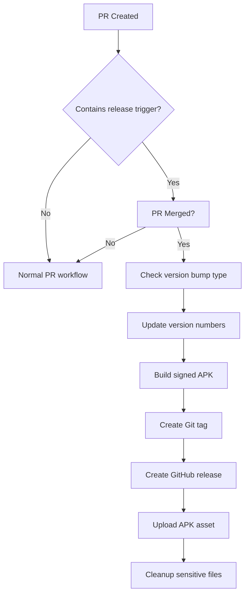

# 🚀 Automated APK Release Workflow

This repository includes an advanced GitHub Actions workflow that automatically builds and releases signed APK files when specific conditions are met. This documentation covers setup, usage, and customization.

## 📋 Table of Contents

- [Overview](#overview)
- [Features](#features)
- [Prerequisites](#prerequisites)
- [Setup Instructions](#setup-instructions)
- [Usage](#usage)
- [Secrets Configuration](#secrets-configuration)
- [Version Management](#version-management)
- [Troubleshooting](#troubleshooting)
- [Customization](#customization)

## 🔍 Overview

The **Automated APK Release** workflow triggers when a Pull Request with specific criteria is merged to the `main` branch. It automatically:

1. **Detects release triggers** (labels or title patterns)
2. **Determines version bump type** (major/minor/patch)
3. **Updates version numbers** in multiple files
4. **Builds a signed release APK**
5. **Creates a GitHub release** with comprehensive notes
6. **Uploads the APK** as a release asset

## ✨ Features

### 🎯 Smart Release Detection

- **Label-based triggers**: Add `release` label to PR
- **Title-based triggers**: Include `[release]` in PR title
- **Automatic version bumping**: Based on commit messages and PR titles

### 📈 Intelligent Version Management

- **Major bump**: `[major]` or `BREAKING CHANGE` in title
- **Minor bump**: `[minor]`, `feat`, or `feature` in title
- **Patch bump**: Default for bug fixes and small changes

### 🔐 Security Features

- **Signed APK builds** using your release keystore
- **Secure secret handling** with GitHub Secrets
- **Automatic cleanup** of sensitive files

### 📝 Comprehensive Release Notes

- **Auto-generated notes** from PR description
- **Version comparison** and technical details
- **Installation instructions** for end users
- **Build metadata** and checksums

## 🛠️ Prerequisites

Before setting up the workflow, ensure you have:

1. **Android keystore file** for signing releases
2. **GitHub repository** with admin access
3. **React Native project** with Android build configuration
4. **Node.js and npm** properly configured

## 🚀 Setup Instructions

### Step 1: Prepare Your Keystore

If you don't have a release keystore, create one:

```bash
# Navigate to your Android project
cd android/app

# Generate a new keystore (replace with your details)
keytool -genkeypair -v -storetype PKCS12 -keystore release-key.jks -keyalg RSA -keysize 2048 -validity 10000 -alias my-key-alias

# Convert keystore to base64 for GitHub Secrets
base64 -i release-key.jks -o release-key-base64.txt
```

### Step 2: Configure GitHub Secrets

Add these secrets to your GitHub repository (`Settings > Secrets and variables > Actions`):

| Secret Name               | Description                  | Example                  |
| ------------------------- | ---------------------------- | ------------------------ |
| `RELEASE_KEYSTORE_BASE64` | Base64 encoded keystore file | `MIIFXTCCBEWgAwIBAgI...` |
| `RELEASE_STORE_PASSWORD`  | Keystore password            | `your-store-password`    |
| `RELEASE_KEY_ALIAS`       | Key alias name               | `my-key-alias`           |
| `RELEASE_KEY_PASSWORD`    | Key password                 | `your-key-password`      |

### Step 3: Update Build Configuration

Ensure your `android/app/build.gradle` has the signing configuration:

```gradle
android {
    // ... other configuration

    signingConfigs {
        release {
            storeFile file('../../keystore.properties') ? file(keystoreProperties['storeFile']) : null
            storePassword keystoreProperties['storePassword']
            keyAlias keystoreProperties['keyAlias']
            keyPassword keystoreProperties['keyPassword']
        }
    }

    buildTypes {
        release {
            signingConfig signingConfigs.release
            minifyEnabled false
            shrinkResources false
        }
    }
}
```

### Step 4: Add the Workflow File

The workflow file `release-apk.yml` should be placed in `.github/workflows/` directory (already created if you're reading this).

## 🎮 Usage

### Triggering a Release

There are two ways to trigger an automated release:

#### Method 1: Using Labels

1. Create a Pull Request with your changes
2. Add the `release` label to the PR
3. Merge the PR to `main` branch
4. The workflow will automatically trigger

#### Method 2: Using Title Patterns

1. Create a Pull Request with `[release]` in the title
2. Example: `[release] Add new attendance tracking feature`
3. Merge the PR to `main` branch

### Version Bump Control

Control the version increment by including specific keywords in your PR title:

- **Major version bump**: Include `[major]` or `BREAKING CHANGE`
  - `1.0.3` → `2.0.0`
  - Example: `[release][major] Complete UI redesign with breaking changes`

- **Minor version bump**: Include `[minor]`, `feat`, or `feature`
  - `1.0.3` → `1.1.0`
  - Example: `[release] feat: Add new QR code sharing feature`

- **Patch version bump**: Default behavior
  - `1.0.3` → `1.0.4`
  - Example: `[release] Fix attendance calculation bug`

## 🔐 Secrets Configuration

### Required Secrets

| Secret                    | Purpose            | How to Get                                |
| ------------------------- | ------------------ | ----------------------------------------- |
| `RELEASE_KEYSTORE_BASE64` | App signing        | Convert your `.jks` file to base64        |
| `RELEASE_STORE_PASSWORD`  | Keystore access    | Password you set when creating keystore   |
| `RELEASE_KEY_ALIAS`       | Key identification | Alias you specified during key generation |
| `RELEASE_KEY_PASSWORD`    | Key access         | Password for the specific key alias       |

### Security Best Practices

1. **Never commit** keystore files to your repository
2. **Use strong passwords** for keystore and key
3. **Backup your keystore** securely (losing it means you can't update your app)
4. **Rotate secrets** periodically
5. **Limit repository access** to trusted contributors

## 📋 Version Management

### Automatic Updates

The workflow automatically updates version numbers in:

1. **package.json**: `version` field
2. **android/app/build.gradle**: `versionName` and `versionCode`

### Version Components

- **versionName**: Semantic version (e.g., "1.2.3")
- **versionCode**: Integer that increments with each build
- **Git tag**: Created automatically (e.g., "v1.2.3")

### Manual Version Control

If you need to manually set a version:

```bash
# Update package.json
npm version 1.5.0 --no-git-tag-version

# Update Android build.gradle
# Edit versionName and versionCode manually
```

## 🔧 Troubleshooting

### Common Issues

#### 1. Build Failure: "Keystore not found"

**Solution**: Verify your `RELEASE_KEYSTORE_BASE64` secret is correctly set.

```bash
# Regenerate base64 keystore
base64 -i your-keystore.jks | tr -d '\n' > keystore-base64.txt
```

#### 2. Build Failure: "Signing failed"

**Solution**: Check keystore password and alias secrets.

#### 3. Version Update Failure

**Solution**: Ensure the workflow has write permissions to the repository.

#### 4. APK Not Signed

**Solution**: Verify signing configuration in `build.gradle`.

### Debug Mode

Enable debug logging by adding this to your workflow:

```yaml
- name: Debug Information
  run: |
    echo "Current directory: $(pwd)"
    echo "Android files: $(ls -la android/)"
    echo "Gradle version: $(cd android && ./gradlew --version)"
```

## 🎨 Customization

### Modify Release Triggers

Edit the trigger conditions in the workflow:

```yaml
# Add custom triggers
- name: Check Release Trigger
  run: |
    # Your custom logic here
    if [[ "$TITLE" == *"[deploy]"* ]]; then
      SHOULD_RELEASE=true
    fi
```

### Custom Release Notes

Modify the release notes template:

```yaml
- name: Generate Release Notes
  run: |
    cat > release-notes.md << EOF
    ## Your Custom Release Notes Template
    ### Changes
    ${{ github.event.pull_request.body }}
    EOF
```

### Add Slack/Discord Notifications

```yaml
- name: Notify Success
  uses: 8398a7/action-slack@v3
  with:
    status: success
    text: '🎉 New release v${{ steps.new-version.outputs.new }} is available!'
  env:
    SLACK_WEBHOOK_URL: ${{ secrets.SLACK_WEBHOOK }}
```

### Multiple APK Variants

Build different APK variants:

```yaml
- name: Build Multiple Variants
  run: |
    cd android
    ./gradlew assembleRelease
    ./gradlew assembleDebug
```

## 📱 End-User Instructions

When a release is created, users can:

1. **Download the APK** from the GitHub Releases page
2. **Enable "Install from Unknown Sources"** on their Android device
3. **Install the APK** directly
4. **Check the release notes** for new features and changes

## 🔄 Workflow Lifecycle



## 🤝 Contributing

To improve this workflow:

1. **Test changes** in a fork first
2. **Document modifications** clearly
3. **Follow security best practices**
4. **Submit a PR** with detailed description

## 📞 Support

If you encounter issues:

1. **Check the workflow logs** in GitHub Actions
2. **Review this documentation** for common solutions
3. **Create an issue** with detailed error information
4. **Tag maintainers** for faster response

---

**⚠️ Important Notes:**

- This workflow has **write access** to your repository
- **Backup your keystore** before implementing
- **Test thoroughly** in a development environment first
- **Keep secrets secure** and rotate them regularly

**✨ Happy Releasing!** 🚀
