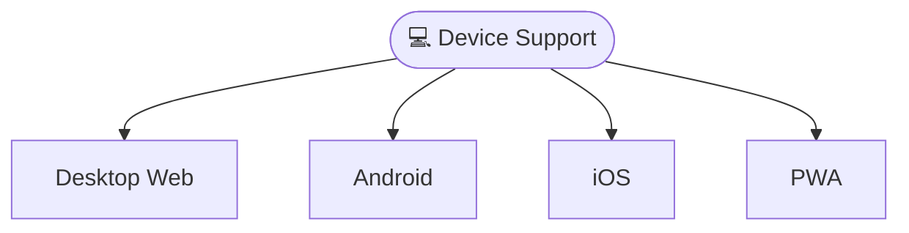
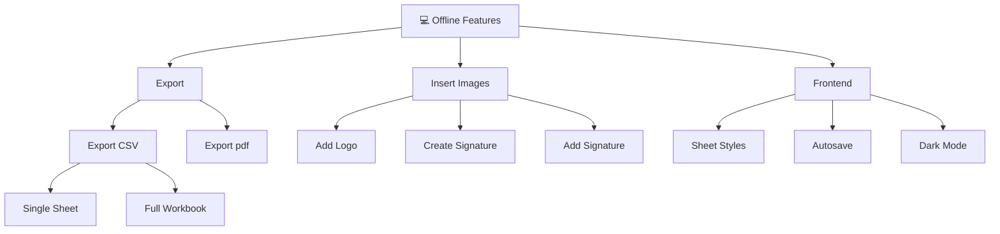
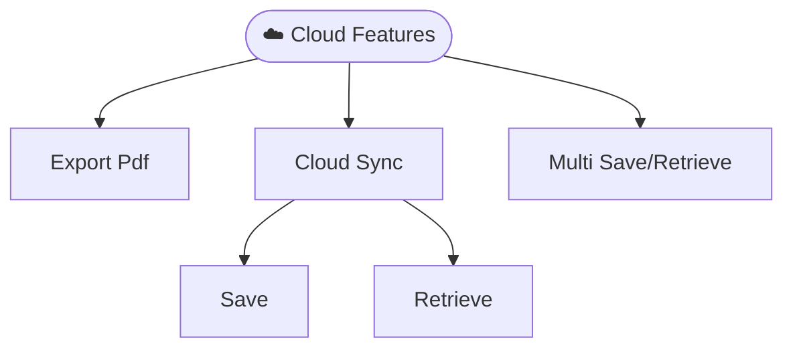
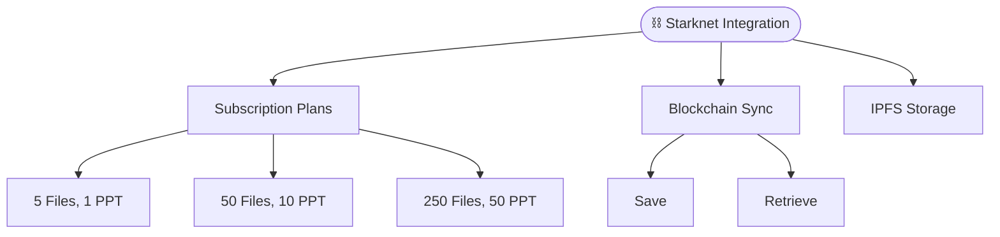

# 🏛️ Government Medical Billing Form

A comprehensive Progressive Web Application (PWA) built with Ionic 8 and React for government invoice billing with advanced offline capabilities, modern UI/UX, and cross-platform compatibility.

## Project Overview

The Government Billing Solution MVP is a modern, feature-rich billing application designed specifically for government agencies and public sector organizations. Built as a Progressive Web App, it provides a native app-like experience while maintaining web accessibility and cross-platform compatibility.

## Device Support (Web, Android, Ios, PWA)



## 🗂️ Project Structure

```
src/
├── components/           # Reusable UI components
│   ├── Files/           # File management components
│   ├── FileMenu/        # File operations menu
│   ├── Menu/            # Application menu
│   ├── socialcalc/      # Spreadsheet engine
│   └── Storage/         # Local storage management
├── contexts/            # React contexts for state management
├── hooks/               # Custom React hooks
├── pages/              # Main application pages
├── services/           # Application services
├── theme/              # CSS themes and variables
└── utils/              # Utility functions
```

# C4GT DMP'25 Contributions:

## ✨ Features Overview

### 🏠 Core Application Features


| #      | Feature                    | Description                                                               | Documentation                                           |
| ------ | -------------------------- | ------------------------------------------------------------------------- | ------------------------------------------------------- |
| **1**  | **Autosave Functionality** | Automatic saving with configurable intervals and manual save options      | [📄 View Details](.github/1.AUTOSAVE_FEATURE.md)        |
| **2**  | **Dark Mode Theme**        | Complete dark/light theme switching with system preference detection      | [📄 View Details](.github/2.DARK_MODE.md)               |
| **3**  | **Logo Integration**       | Company logo upload, management, and invoice integration                  | [📄 View Details](.github/3.ADD_LOGO_FEATURE.md)        |
| **4**  | **Advanced Cell Styling**  | Rich text formatting, colors, borders, and alignment options              | [📄 View Details](.github/4.SHEET_CELL_STYLING.md)      |
| **5**  | **Export Functionality**   | PDF, CSV, and multi-sheet export with mobile sharing support              | [📄 View Details](.github/5.CLIENT_EXPORT_FEATURES.md)  |
| **6**  | **Camera Integration**     | Photo capture for receipts and documentation using device camera          | [📄 View Details](.github/6.CAPACITOR_CAMERA_PLUGIN.md) |
| **7**  | **App Icons & Splash**     | Professional branding with adaptive icons and splash screens              | [📄 View Details](.github/7.APP_ICONS_SPLASH_SCREEN.md) |
| **8**  | **Digital Signatures**     | Electronic signature capture and integration into invoices                | [📄 View Details](.github/8.SIGNATURE_PLUGIN.md)        |
| **9**  | **Storage Management**     | Intelligent quota handling and storage optimization                       | [📄 View Details](.github/9.STORAGE_QUOTA_HANDLING.md)  |
| **10** | **PWA & Ionic 8 Upgrade**  | Progressive Web App capabilities with latest Ionic framework              | [📄 View Details](.github/10.PWA_IONIC_UPGRADE.md)      |
| **11** | **Bulk File Operations**   | Save all to server & move all from server with progress tracking          | [📄 View Details](.github/11.BULK_FILE_OPERATIONS.md)   |
| **12** | **Starknet Integration**   | Blockchain file storage with IPFS, token subscriptions, and Web3 features | [📄 View Details](.github/12_STARKNET_INTEGRATION.md)   |


## 1. Offline Features

## 2. Cloud Features (AWS S3)

## 3. Blockchain Integration (Starknet)


### 📱 Progressive Web App Features

- **Offline Functionality**: Full app functionality without internet connection
- **App Installation**: Install directly from browser with native app experience
- **Background Sync**: Sync data when connection is restored
- **Push Notifications**: Local notifications for important events
- **App Shortcuts**: Quick access to create invoice, view invoices, and manage customers
- **Standalone Display**: Full-screen app experience when installed
- **App-like UI**: Native-feeling interface with proper theming
- 
#### 📊 Performance Metrics

- **Load Times**: Measure initial load and navigation performance
- **Cache Hit Rates**: Monitor offline capability effectiveness
- **Storage Usage**: Track local storage and quota usage

## 🛠️ Technology Stack

### Frontend Framework

- **React 18.2.0** - Modern UI library with hooks and concurrent features
- **TypeScript 5.1.6** - Type-safe development environment
- **Ionic 8.0.0** - Cross-platform UI components and native app features
- **Vite 5.0.0** - Fast build tool and development server

### PWA & Mobile

- **Vite PWA Plugin 0.19.0** - Progressive Web App capabilities
- **Capacitor 6.0.0** - Native app deployment for iOS and Android
- **Capacitor Plugins** - Camera, filesystem, preferences, and sharing capabilities

### Spreadsheet Engine

- **SocialCalc** - Powerful spreadsheet engine for invoice creation and calculation
- **Custom Extensions** - Enhanced functionality for government billing needs


## 🚀 Quick Start

### Prerequisites

- **Node.js 16+** (LTS recommended)
- **npm 8+** or **yarn 1.22+**

### Installation

```bash
# Clone the repository
git clone https://github.com/<your_username>/<repo_name>.git
cd <repo_name>

# Install dependencies
npm install

# Generate PWA assets (icons, manifest)
npm run generate-pwa-assets

# Start development server
npm run dev
or ionic serve

# Build for production
npm run build
or ionic build

# Preview production build
npm run preview
```

### Mobile Development

```bash
# Add Capacitor (if not already added)
ionic integrations enable capacitor

# Add mobile platforms
npx cap add android
npx cap add ios

# Sync web app with native platforms
npx cap sync

# Open in native IDEs
npx cap open android
npx cap open ios

# (Optional) Run on mobile
ionic capacitor run android -l --external
ionic capacitor run ios -l --external
```

## 🤝 Contributing

1. Fork the repository
2. Create your feature branch (`git checkout -b feature/AmazingFeature`)
3. Commit your changes (`git commit -m 'Add some AmazingFeature'`)
4. Push to the branch (`git push origin feature/AmazingFeature`)
5. Open a Pull Request

## 📄 License

This project is licensed under the MIT License - see the [LICENSE](LICENSE) file for details.

## 🙏 Acknowledgments

- Built with [Ionic Framework](https://ionicframework.com/)
- Powered by [React](https://reactjs.org/)
- Spreadsheet functionality by [SocialCalc](https://socialcalc.org/)
- PWA capabilities with [Vite PWA Plugin](https://vite-pwa-org.netlify.app/)

## 📞 Support

For support, email the Contributor [anis42390@gmail.com] or create an issue in this repository.

---

**Made with ❤️ under C4GT DMP'25 Program**
