# � Health Tracker App

A comprehensive Progressive Web Application (PWA) built with Ionic 8 and React for health monitoring, nutrition tracking, weight management, and exercise logging with advanced offline capabilities, modern UI/UX, and cross-platform compatibility.

## Project Overview

The Health Tracker Solution MVP is a modern, feature-rich health monitoring application designed for individuals seeking to improve their wellness journey. Built as a Progressive Web App, it provides a native app-like experience while maintaining web accessibility and cross-platform compatibility.

## Device Support (Web, Android, Ios, PWA)

```mermaid
flowchart TD
    A([💻 Device Support]) --> B[Desktop Web]
    A --> C[Android]
    A --> D[iOS]
    A --> E[PWA]
```



## 🗂️ Project Structure

```
src/
├── components/           # Reusable UI components
│   ├── Files/           # File management components
│   ├── FileMenu/        # File operations menu
│   ├── Menu/            # Application menu
│   ├── socialcalc/      # Spreadsheet engine for health data
│   └── Storage/         # Local storage management
├── contexts/            # React contexts for state management
├── hooks/               # Custom React hooks
├── pages/              # Main application pages
├── services/           # Application services
├── theme/              # CSS themes and variables
└── utils/              # Utility functions
```

# C4GT DMP'25 Contributions:

## ✨ Features Overview

### 🏠 Core Application Features

| #      | Feature                   | Description                                                              | Documentation                                      |
| ------ | ------------------------- | ------------------------------------------------------------------------ | -------------------------------------------------- |
| **1**  | **Diet Logging**          | Track daily meals, calories, and nutritional intake with smart templates | [📄 View Details](.github/1.DIET_LOGGING.md)       |
| **2**  | **Nutrition Tracking**    | Monitor macros, vitamins, minerals with comprehensive food database      | [📄 View Details](.github/2.NUTRITION_TRACKING.md) |
| **3**  | **Weight Management**     | Track weight progress with charts, trends, and goal setting              | [📄 View Details](.github/3.WEIGHT_TRACKER.md)     |
| **4**  | **Exercise Tracking**     | Log workouts, track progress, and monitor fitness goals                  | [📄 View Details](.github/4.EXERCISE_TRACKING.md)  |
| **5**  | **Health Analytics**      | Comprehensive health reports and progress visualization                  | [📄 View Details](.github/5.HEALTH_ANALYTICS.md)   |
| **6**  | **Dark Mode Theme**       | Complete dark/light theme switching with system preference detection     | [📄 View Details](.github/6.DARK_MODE.md)          |
| **7**  | **Photo Integration**     | Take photos of meals and exercises using device camera                   | [📄 View Details](.github/7.PHOTO_INTEGRATION.md)  |
| **8**  | **Export Functionality**  | Export health data as PDF, CSV with sharing capabilities                 | [📄 View Details](.github/8.EXPORT_FEATURES.md)    |
| **9**  | **Offline Capabilities**  | Full offline functionality with automatic sync when online               | [📄 View Details](.github/9.OFFLINE_MODE.md)       |
| **10** | **PWA & Ionic 8 Upgrade** | Progressive Web App capabilities with latest Ionic framework             | [📄 View Details](.github/10.PWA_IONIC_UPGRADE.md) |
| **11** | **Health Templates**      | Pre-built templates for common health and fitness goals                  | [📄 View Details](.github/11.HEALTH_TEMPLATES.md)  |
| **12** | **Data Backup & Sync**    | Cloud backup with data synchronization across devices                    | [📄 View Details](.github/12.DATA_SYNC.md)         |
| **13** | **Graph Visualization**   | Interactive charts for nutrition data with bar and pie chart views       | [📄 View Details](GRAPH_VISUALIZATION_README.md)   |

## 1. Health Tracking Features

```mermaid
flowchart TD
    A[🏥 Health Features] --> B[Diet Logging]
    A --> C[Nutrition Tracking]
    A --> D[Weight Management]
    A --> E[Exercise Tracking]

    %% Diet Logging branch
    B --> F[Meal Tracking]
    B --> G[Calorie Counter]
    B --> H[Food Photos]

    %% Nutrition Tracking branch
    C --> I[Macro Tracking]
    C --> J[Vitamin Monitor]
    C --> K[Mineral Intake]

    %% Weight Management branch
    D --> L[Weight Logs]
    D --> M[Progress Charts]
    D --> N[Goal Setting]

    %% Exercise Tracking branch
    E --> O[Workout Logs]
    E --> P[Activity Monitor]
    E --> Q[Fitness Goals]
```



## 2. Data Export & Sharing

```mermaid
flowchart TD
    A([📊 Export Features]) --> B[Health Reports]
    A --> C[Data Sharing]
    A --> D[Progress Export]
    B --> E[PDF Reports]
    B --> F[CSV Data]
    C --> G[Share with Trainer]
    C --> H[Medical Records]
    D --> I[Weekly Summary]
    D --> J[Monthly Progress]
```



## 3. Health Templates & Goals

```mermaid
flowchart TD
    A([🎯 Health Templates]) --> B[Weight Loss]
    A --> C[Muscle Gain]
    A --> D[Nutrition Plans]
    B --> E[Calorie Deficit]
    B --> F[Cardio Plans]
    C --> G[Protein Focus]
    C --> H[Strength Training]
    D --> I[Balanced Diet]
    D --> J[Special Diets]
    D --> K[Meal Planning]
```



### 📱 Progressive Web App Features

- **Offline Functionality**: Full app functionality without internet connection
- **App Installation**: Install directly from browser with native app experience
- **Background Sync**: Sync health data when connection is restored
- **Push Notifications**: Reminders for meals, workouts, and health goals
- **App Shortcuts**: Quick access to log meals, track weight, and start workouts
- **Standalone Display**: Full-screen app experience when installed
- **App-like UI**: Native-feeling interface with proper theming

#### 📊 Performance Metrics

- **Load Times**: Measure initial load and navigation performance
- **Cache Hit Rates**: Monitor offline capability effectiveness
- **Storage Usage**: Track local storage and health data quota usage

## 🛠️ Technology Stack

### Frontend Framework

- **React 18.2.0** - Modern UI library with hooks and concurrent features
- **TypeScript 5.1.6** - Type-safe development environment
- **Ionic 8.0.0** - Cross-platform UI components and native app features
- **Vite 5.0.0** - Fast build tool and development server

### PWA & Mobile

- **Vite PWA Plugin 0.19.0** - Progressive Web App capabilities
- **Capacitor 6.0.0** - Native app deployment for iOS and Android
- **Capacitor Plugins** - Camera, filesystem, preferences, and sharing capabilities

### Spreadsheet Engine

- **SocialCalc** - Powerful spreadsheet engine for health data tracking and calculation
- **Custom Extensions** - Enhanced functionality for health monitoring and goal tracking

## 🚀 Quick Start

### Prerequisites

- **Node.js 16+** (LTS recommended)
- **npm 8+** or **yarn 1.22+**

### Installation

```bash
# Clone the repository
git clone https://github.com/<your_username>/health-tracker.git
cd health-tracker

# Install dependencies
npm install

# Generate PWA assets (icons, manifest)
npm run generate-pwa-assets

# Start development server
npm run dev
or ionic serve

# Build for production
npm run build
or ionic build

# Preview production build
npm run preview
```

### Mobile Development

```bash
# Add Capacitor (if not already added)
ionic integrations enable capacitor

# Add mobile platforms
npx cap add android
npx cap add ios

# Sync web app with native platforms
npx cap sync

# Open in native IDEs
npx cap open android
npx cap open ios

# (Optional) Run on mobile
ionic capacitor run android -l --external
ionic capacitor run ios -l --external
```

## 🤝 Contributing

1. Fork the repository
2. Create your feature branch (`git checkout -b feature/AmazingFeature`)
3. Commit your changes (`git commit -m 'Add some AmazingFeature'`)
4. Push to the branch (`git push origin feature/AmazingFeature`)
5. Open a Pull Request

## 📄 License

This project is licensed under the MIT License - see the [LICENSE](LICENSE) file for details.

## 🙏 Acknowledgments

- Built with [Ionic Framework](https://ionicframework.com/)
- Powered by [React](https://reactjs.org/)
- Spreadsheet functionality by [SocialCalc](https://socialcalc.org/)
- PWA capabilities with [Vite PWA Plugin](https://vite-pwa-org.netlify.app/)

## 📞 Support

For support, email the Contributor [anis42390@gmail.com] or create an issue in this repository.

---

**Made with ❤️ under C4GT DMP'25 Program - Your Health, Your Journey**
