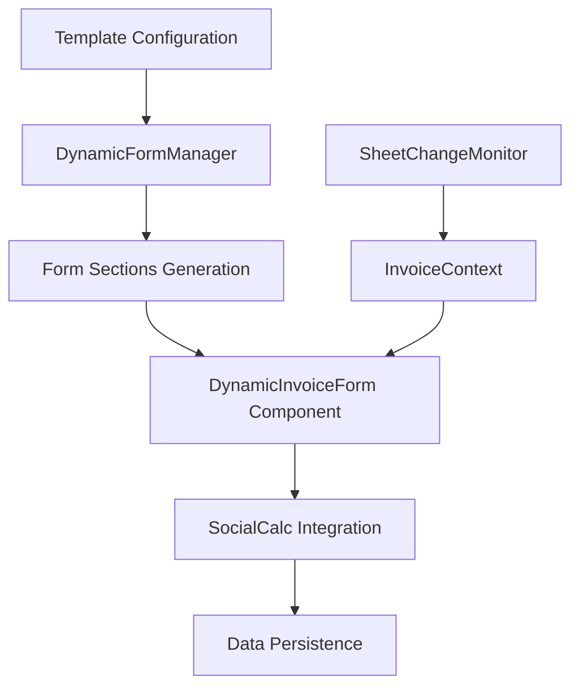

# 🚀 Dynamic Form Generation System

A comprehensive guide to the Dynamic Form Generation system in SocialCalc-MultiApp-Firebase, enabling automatic form creation based on spreadsheet cell mappings and real-time sheet synchronization.

## 📋 Table of Contents

- [Overview](#overview)
- [System Architecture](#system-architecture)
- [Key Components](#key-components)
- [Configuration Guide](#configuration-guide)
- [API Reference](#api-reference)
- [Usage Examples](#usage-examples)
- [Advanced Features](#advanced-features)
- [Troubleshooting](#troubleshooting)
- [Best Practices](#best-practices)
- [Migration Guide](#migration-guide)

## 🔍 Overview

The Dynamic Form Generation system automatically creates and manages forms based on spreadsheet cell mappings, providing seamless integration between user input forms and SocialCalc spreadsheets. The system supports:

- **Automatic Form Generation**: Forms are created dynamically from cell mapping configurations
- **Real-time Sheet Synchronization**: Forms automatically switch when users change spreadsheet sheets
- **Multi-template Support**: Different templates with unique form structures
- **Type-safe Configuration**: Full TypeScript support with robust interfaces
- **Field Type Detection**: Intelligent field type assignment based on labels
- **Complex Data Structures**: Support for nested objects and repeating item sections

## 🏗️ System Architecture

### Core Components Flow



### Data Flow

1. **Configuration**: Templates define cell mappings for each sheet
2. **Form Generation**: `DynamicFormManager` processes cell mappings into form sections
3. **Rendering**: `DynamicInvoiceForm` renders the generated form structure
4. **Sheet Monitoring**: `SheetChangeMonitor` detects sheet changes in SocialCalc
5. **Context Updates**: `InvoiceContext` manages current sheet state
6. **Real-time Sync**: Forms automatically update when sheets change
7. **Data Persistence**: Form data is written back to spreadsheet cells

## 🔧 Key Components

### DynamicFormManager

The core utility class responsible for form generation and data processing.

```typescript
export class DynamicFormManager {
  // Generate form sections from cell mappings
  static generateFormSections(cellMappings: any): DynamicFormSection[]
  
  // Get form sections for a specific sheet
  static getFormSectionsForSheet(template: TemplateData, sheetId: string): DynamicFormSection[]
  
  // Convert form data to spreadsheet format
  static convertToSpreadsheetFormat(formData: ProcessedFormData, sections: DynamicFormSection[], sheetId: string): any[]
  
  // Initialize empty form data
  static initializeFormData(sections: DynamicFormSection[]): ProcessedFormData
  
  // Validate form data
  static validateFormData(formData: ProcessedFormData, sections: DynamicFormSection[]): {isValid: boolean, errors: string[]}
}
```

### DynamicInvoiceForm Component

React component that renders the dynamic forms with full Ionic UI integration.

```typescript
interface DynamicInvoiceFormProps {
  isOpen: boolean;
  onClose: () => void;
}

const DynamicInvoiceForm: React.FC<DynamicInvoiceFormProps>
```

### SheetChangeMonitor

Utility for monitoring SocialCalc sheet changes and triggering context updates.

```typescript
export class SheetChangeMonitor {
  static initialize(updateSheetId: (sheetId: string) => void): void
  static cleanup(): void
  private static checkCurrentSheet(): void
}
```

### InvoiceContext

React context managing the current template data and sheet state.

```typescript
interface InvoiceContextType {
  activeTemplateData: TemplateData | null;
  currentSheetId: string | null;
  updateCurrentSheetId: (sheetId: string) => void;
  // ... other context properties
}
```

## ⚙️ Configuration Guide

### Template Structure

Templates are defined in `src/templates.ts` with the following structure:

```typescript
export interface TemplateData {
  template: string;           // Template name
  templateId: number;         // Unique identifier
  category: string;           // Template category
  msc: {                     // SocialCalc configuration
    numsheets: number;
    currentid: string;
    currentname: string;
    sheetArr: { [sheetName: string]: any };
    EditableCells: {
      allow: boolean;
      cells: { [cellName: string]: boolean };
      constraints: { [cellName: string]: [string, string, string, string] };
    };
  };
  footers: Array<{          // Footer configurations
    name: string;
    index: number;
    isActive: boolean;
  }>;
  logoCell: string | { [sheetName: string]: string };     // Logo placement
  signatureCell: string | { [sheetName: string]: string }; // Signature placement
  cellMappings: {           // Form field to cell mappings
    [sheetName: string]: CellMapping;
  };
}
```

### Cell Mapping Configuration

Cell mappings define how form fields map to spreadsheet cells:

```typescript
export interface CellMapping {
  [fieldName: string]: string | ItemsConfig | NestedField;
}

// Simple field mapping
"Heading": "B2"

// Nested object mapping
"From": {
  "Name": "C12",
  "StreetAddress": "C13",
  "Phone": "C15",
  "Email": "C16"
}

// Items/table configuration
"Items": {
  "Name": "Items",
  "Rows": { "start": 23, "end": 35 },
  "Columns": {
    "Description": "B",
    "Quantity": "D",
    "Rate": "E",
    "Amount": "F"
  }
}
```

### Field Type Detection

The system automatically detects field types based on field labels:

| Label Contains | Detected Type | HTML Input Type |
|----------------|---------------|-----------------|
| `email` | `email` | `email` |
| `number`, `#` | `number` | `number` |
| `rate`, `amount`, `price`, `tax`, `hours`, `qty` | `decimal` | `number` (with step="0.01") |
| `notes`, `description` | `textarea` | `textarea` |
| Default | `text` | `text` |

## 📚 API Reference

### DynamicFormSection Interface

```typescript
export interface DynamicFormSection {
  title: string;                    // Section heading
  fields: DynamicFormField[];       // Form fields in this section
  isItems?: boolean;                // Whether this is an items/table section
  itemsConfig?: {                   // Configuration for items sections
    name: string;
    range: { start: number; end: number };
    content: { [key: string]: string };
  };
}
```

### DynamicFormField Interface

```typescript
export interface DynamicFormField {
  label: string;                    // Field label
  value: string;                    // Current field value
  type: "text" | "email" | "number" | "decimal" | "textarea"; // Input type
  cellMapping: string;              // Target cell reference
}
```

### ProcessedFormData Interface

```typescript
export interface ProcessedFormData {
  [sectionKey: string]: any;        // Section data (object or array for items)
}
```

## 💡 Usage Examples

### Example 1: Simple Invoice Form

Configuration for a basic invoice form:

```typescript
const simpleInvoiceMapping = {
  "Heading": "B2",
  "Date": "G4",
  "InvoiceNumber": "B5",
  "From": {
    "CompanyName": "B8",
    "Address": "B9",
    "Phone": "B10",
    "Email": "B11"
  },
  "BillTo": {
    "CustomerName": "B14",
    "Address": "B15",
    "Phone": "B16"
  },
  "Items": {
    "Name": "Items",
    "Rows": { "start": 20, "end": 30 },
    "Columns": {
      "Description": "B",
      "Quantity": "D",
      "Rate": "E",
      "Amount": "F"
    }
  },
  "Total": "F32"
};
```

### Example 2: Service Invoice vs Product Invoice

Different sheets can have different item structures:

```typescript
// Sheet 1: Service Invoice
const serviceInvoiceMapping = {
  "Items": {
    "Name": "Services",
    "Rows": { "start": 6, "end": 18 },
    "Columns": {
      "Description": "B",
      "Hours": "E",        // Time-based
      "Rate": "F"
    }
  }
};

// Sheet 2: Product Invoice  
const productInvoiceMapping = {
  "Items": {
    "Name": "Products",
    "Rows": { "start": 6, "end": 18 },
    "Columns": {
      "Description": "B",
      "Qty": "E",          // Quantity-based
      "Price": "F"
    }
  }
};
```

### Example 3: Programmatic Form Generation

```typescript
// Generate form sections from template
const template = DATA[1001]; // Get template by ID
const currentSheetId = "sheet1";
const formSections = DynamicFormManager.getFormSectionsForSheet(template, currentSheetId);

// Initialize form data
const initialFormData = DynamicFormManager.initializeFormData(formSections);

// Validate form data
const validation = DynamicFormManager.validateFormData(formData, formSections);
if (!validation.isValid) {
  console.error("Validation errors:", validation.errors);
}

// Convert to spreadsheet format for saving
const spreadsheetData = DynamicFormManager.convertToSpreadsheetFormat(
  formData, 
  formSections, 
  currentSheetId
);
```

## 🚀 Advanced Features

### Real-time Sheet Synchronization

The system monitors SocialCalc for sheet changes and automatically updates forms:

```typescript
// Initialize in your main component
useEffect(() => {
  if (fileName && activeTemplateData) {
    const timer = setTimeout(() => {
      SheetChangeMonitor.initialize(updateCurrentSheetId);
    }, 1000);

    return () => {
      clearTimeout(timer);
      SheetChangeMonitor.cleanup();
    };
  }
}, [fileName, activeTemplateData, updateCurrentSheetId]);
```

### Custom Field Validation

Extend validation for specific field types:

```typescript
// Custom validation in DynamicFormManager
static validateFormData(formData: ProcessedFormData, sections: DynamicFormSection[]) {
  const errors: string[] = [];
  
  sections.forEach(section => {
    section.fields.forEach(field => {
      const value = formData[section.title]?.[field.label];
      
      // Email validation
      if (field.type === "email" && value && !this.isValidEmail(value)) {
        errors.push(`Invalid email format: ${field.label}`);
      }
      
      // Add custom validations here
      if (field.label.includes("Phone") && value && !this.isValidPhone(value)) {
        errors.push(`Invalid phone format: ${field.label}`);
      }
    });
  });
  
  return { isValid: errors.length === 0, errors };
}
```

### Dynamic Item Management

Items sections support dynamic add/remove operations:

```typescript
// Add new item
const handleAddItem = (sectionTitle: string) => {
  setFormData(prev => {
    const currentItems = prev[sectionTitle] as any[];
    const section = formSections.find(s => s.title === sectionTitle);
    const maxItems = section.itemsConfig!.range.end - section.itemsConfig!.range.start + 1;
    
    if (currentItems.length >= maxItems) {
      showToastMessage(`Maximum ${maxItems} items allowed`, "warning");
      return prev;
    }
    
    const newItem: any = {};
    Object.keys(section.itemsConfig!.content).forEach(contentKey => {
      newItem[contentKey] = "";
    });
    
    return {
      ...prev,
      [sectionTitle]: [...currentItems, newItem]
    };
  });
};

// Remove item
const handleRemoveItem = (sectionTitle: string, itemIndex: number) => {
  setFormData(prev => {
    const currentItems = prev[sectionTitle] as any[];
    
    if (currentItems.length <= 1) {
      showToastMessage("At least one item is required", "warning");
      return prev;
    }
    
    const updatedItems = currentItems.filter((_, index) => index !== itemIndex);
    return { ...prev, [sectionTitle]: updatedItems };
  });
};
```

## 🔧 Troubleshooting

### Common Issues and Solutions

#### 1. Form Not Updating When Sheet Changes

**Problem**: Form doesn't change when switching sheets in SocialCalc.

**Solution**: Ensure `SheetChangeMonitor` is properly initialized:

```typescript
// Check if monitor is running
console.log("Monitor active:", SheetChangeMonitor.isActive);

// Reinitialize if needed
SheetChangeMonitor.cleanup();
SheetChangeMonitor.initialize(updateCurrentSheetId);
```

#### 2. Field Values Not Saving

**Problem**: Form data not persisting to spreadsheet cells.

**Solution**: Verify cell mappings and conversion process:

```typescript
// Debug cell mappings
console.log("Cell mappings:", template.cellMappings[currentSheetId]);

// Check conversion output
const converted = DynamicFormManager.convertToSpreadsheetFormat(
  formData, formSections, currentSheetId
);
console.log("Converted data:", converted);
```

#### 3. Validation Errors

**Problem**: Form validation failing unexpectedly.

**Solution**: Check field types and validation rules:

```typescript
// Debug validation
const validation = DynamicFormManager.validateFormData(formData, formSections);
console.log("Validation result:", validation);

// Check field types
formSections.forEach(section => {
  section.fields.forEach(field => {
    console.log(`${field.label}: ${field.type}`);
  });
});
```

#### 4. Items Section Not Rendering

**Problem**: Items/table sections not displaying properly.

**Solution**: Verify items configuration structure:

```typescript
// Check items config
const itemsSection = formSections.find(s => s.isItems);
if (itemsSection) {
  console.log("Items config:", itemsSection.itemsConfig);
} else {
  console.log("No items section found");
}

// Verify ItemsConfig structure
const isValidItemsConfig = DynamicFormManager.isItemsConfig(cellMappings.Items);
console.log("Valid items config:", isValidItemsConfig);
```

### Debug Mode

Enable debug logging for troubleshooting:

```typescript
// In DynamicInvoiceForm component
const DEBUG_MODE = true;

useEffect(() => {
  if (DEBUG_MODE) {
    console.log("Current sheet ID:", effectiveSheetId);
    console.log("Form sections:", formSections);
    console.log("Form data:", formData);
  }
}, [effectiveSheetId, formSections, formData]);
```

## 📝 Best Practices

### 1. Template Design

- **Consistent Cell Layout**: Use consistent cell patterns across similar templates
- **Logical Grouping**: Group related fields in the same section
- **Clear Naming**: Use descriptive field names that indicate their purpose
- **Range Planning**: Plan item ranges with room for growth

```typescript
// Good: Clear, consistent naming
"BillTo": {
  "CustomerName": "B15",
  "CustomerAddress": "B16", 
  "CustomerPhone": "B17",
  "CustomerEmail": "B18"
}

// Avoid: Inconsistent or unclear naming
"Customer": {
  "nm": "B15",
  "addr": "B16",
  "tel": "B17", 
  "mail": "B18"
}
```

### 2. Field Type Optimization

- **Use Specific Types**: Leverage automatic type detection with descriptive labels
- **Validation Ready**: Design field names to work with built-in validation

```typescript
// Automatic type detection works well with these patterns:
"CustomerEmail": "B10",        // → email type
"ItemQuantity": "D5",          // → decimal type  
"OrderNumber": "C3",           // → number type
"ProductDescription": "B7",     // → textarea type
"CompanyName": "B8"            // → text type
```

### 3. Performance Optimization

- **Minimal Polling**: Keep sheet change monitoring interval reasonable (500ms default)
- **Efficient Updates**: Use React's useMemo for expensive computations
- **Cleanup**: Always cleanup monitors and effects

```typescript
// Efficient form sections computation
const formSections = useMemo(() => {
  if (!currentTemplate) return [];
  return DynamicFormManager.getFormSectionsForSheet(currentTemplate, effectiveSheetId);
}, [currentTemplate, effectiveSheetId]); // Only recompute when these change

// Proper cleanup
useEffect(() => {
  return () => {
    SheetChangeMonitor.cleanup();
  };
}, []);
```

### 4. Error Handling

- **Graceful Degradation**: Provide fallbacks when data is missing
- **User Feedback**: Show clear error messages to users
- **Validation**: Validate data at multiple levels

```typescript
// Graceful fallback
const effectiveSheetId = useMemo(() => {
  return currentSheetId || currentTemplate?.msc?.currentid || "sheet1";
}, [currentSheetId, currentTemplate]);

// User-friendly error handling
try {
  const validation = DynamicFormManager.validateFormData(formData, formSections);
  if (!validation.isValid) {
    showToastMessage(`Please fix: ${validation.errors.join(", ")}`, "danger");
    return;
  }
} catch (error) {
  console.error("Validation error:", error);
  showToastMessage("Unable to validate form data", "danger");
}
```

## 🔄 Migration Guide

### From Static Forms to Dynamic Forms

If migrating from static form implementations:

#### Step 1: Define Cell Mappings

```typescript
// Convert static form structure to cell mappings
const staticForm = {
  companyName: "B8",
  companyAddress: "B9"
};

// Becomes dynamic mapping
const dynamicMapping = {
  "Company": {
    "Name": "B8", 
    "Address": "B9"
  }
};
```

#### Step 2: Update Components

```typescript
// Replace static form fields
<IonInput value={companyName} onIonInput={...} />

// With dynamic form rendering
{formSections.map(section => renderSection(section))}
```

#### Step 3: Migrate Data Handling

```typescript
// Replace manual cell updates
SocialCalc.GetWorkBookControl().workbook.spreadsheet.editor.EditorScheduleSheetCommands(
  null, "set B8 text t Company Name", false, true
);

// With dynamic form conversion
const spreadsheetData = DynamicFormManager.convertToSpreadsheetFormat(
  formData, formSections, currentSheetId
);
```

### Version Compatibility

The dynamic form system is designed to be backward compatible:

- **Existing templates** continue to work without modification
- **Static forms** can coexist with dynamic forms
- **Gradual migration** is supported - migrate templates one at a time

## 🔐 Security Considerations

### Data Validation

- All form inputs are validated before processing
- Cell references are sanitized to prevent injection attacks
- TypeScript provides compile-time type safety

### Access Control

```typescript
// Template-level access control
const allowedCells = currentTemplate.msc.EditableCells.cells;
const cellReference = field.cellMapping;

if (!allowedCells[cellReference]) {
  console.warn(`Cell ${cellReference} is not editable`);
  return;
}
```

### Constraints

```typescript
// Cell-level constraints from template
const constraints = currentTemplate.msc.EditableCells.constraints;
const cellConstraint = constraints[cellReference];

if (cellConstraint) {
  const [minValue, maxValue, pattern, message] = cellConstraint;
  // Apply constraint validation
}
```

## 🚀 Future Enhancements

### Planned Features

1. **Custom Field Types**: Support for date pickers, dropdowns, file uploads
2. **Conditional Logic**: Show/hide fields based on other field values  
3. **Formula Integration**: Direct formula evaluation in form fields
4. **Batch Operations**: Bulk import/export of form data
5. **Real-time Collaboration**: Multi-user form editing
6. **Form Templates**: Reusable form configurations
7. **Advanced Validation**: Custom validation rules and async validation
8. **Theming**: Customizable form styling and layouts

### Extension Points

The system is designed for extensibility:

```typescript
// Custom field type extension
export interface CustomFormField extends DynamicFormField {
  customType?: "date" | "dropdown" | "file";
  options?: string[]; // For dropdown
  validation?: (value: any) => boolean; // Custom validation
}

// Custom section type
export interface CustomFormSection extends DynamicFormSection {
  conditional?: {
    dependsOn: string;
    showWhen: any;
  };
}
```

---

## 📞 Support and Contributing

### Getting Help

1. **Check the troubleshooting section** above for common issues
2. **Review the API documentation** for implementation details
3. **Examine existing templates** in `src/templates.ts` for examples
4. **Create an issue** with detailed error information if problems persist

### Contributing

To improve the dynamic form system:

1. **Follow TypeScript best practices** for type safety
2. **Add comprehensive tests** for new features
3. **Update documentation** for any API changes
4. **Maintain backward compatibility** when possible
5. **Submit PRs** with detailed descriptions and examples

### Development Setup

```bash
# Install dependencies
npm install

# Run development server
npm run dev

# Run tests
npm test

# Build for production
npm run build
```

---

**⚠️ Important Notes:**

- **Template Backup**: Always backup templates before making changes
- **Testing**: Test form changes thoroughly across different sheet configurations
- **Performance**: Monitor form rendering performance with large datasets
- **Browser Compatibility**: Ensure forms work across supported browsers

**✨ Happy Form Building!** 🚀
