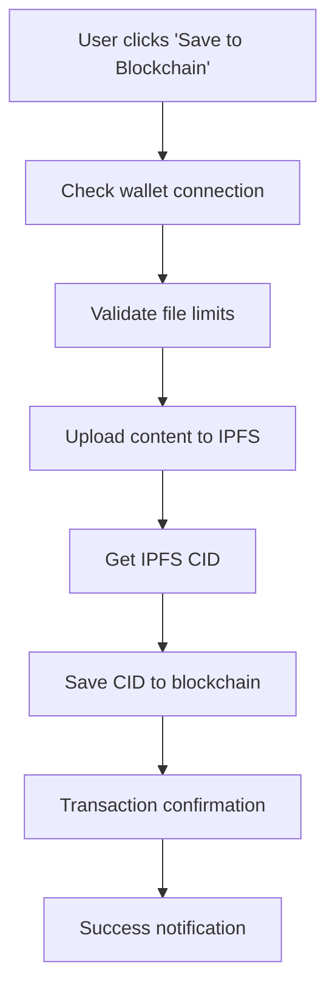
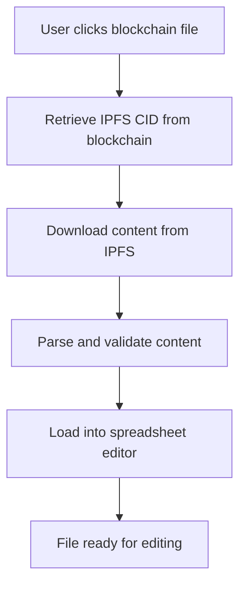
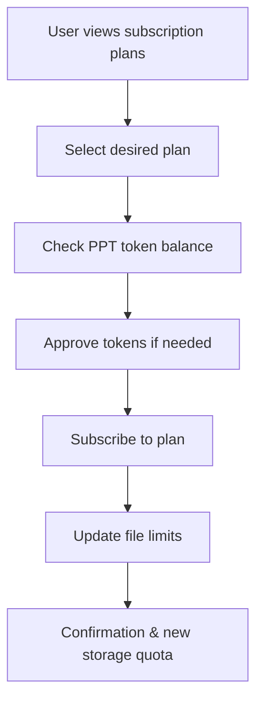

# 🔗 Starknet Blockchain Integration - Comprehensive Guide

## 📜 Smart Contract Links (Sepolia Testnet)

### MedInvoice Contract

**Contract Address:** `0x05edb37e3fcc79257f0969dc6807b5f9b517e260ecddd26779ab082f0f532ad6`
**Voyager Link:** [https://sepolia.voyager.online/contract/0x05edb37e3fcc79257f0969dc6807b5f9b517e260ecddd26779ab082f0f532ad6](https://sepolia.voyager.online/contract/0x05edb37e3fcc79257f0969dc6807b5f9b517e260ecddd26779ab082f0f532ad6)

### MedToken Contract

**Contract Address:** `0x008c6e8700604e987069cfb5debf6fd359dc09f00f1c61ddac1e52b6e5ceff4`
**Voyager Link:** [https://sepolia.voyager.online/contract/0x008c6e8700604e0987069cfb5debf6fd359dc09f00f1c61ddac1e52b6e5ceff4](https://sepolia.voyager.online/contract/0x008c6e8700604e0987069cfb5debf6fd359dc09f00f1c61ddac1e52b6e5ceff4)

---

## 🌟 Overview

The Government Billing Solution MVP integrates with the Starknet blockchain to provide decentralized file storage, subscription management, and token-based access control. This integration combines the power of blockchain immutability with IPFS distributed storage to create a robust, transparent, and scalable billing solution.

### 🎯 Key Features

- **🔐 Decentralized File Storage**: Store invoice files on IPFS with blockchain references
- **💳 Token-Based Subscriptions**: PPT token-powered subscription plans
- **📊 File Limit Management**: Smart contract-enforced storage quotas
- **🔄 Cross-Platform Sync**: Seamless file synchronization across devices
- **⚡ Real-time Updates**: Live blockchain data with automatic refresh
- **🛡️ Transparent Operations**: All transactions visible on Starknet Explorer

---

## 🏗️ Architecture Overview

### Component Structure

```
src/
├── abis/                     # Smart contract ABIs
│   ├── constants.ts          # Contract addresses
│   ├── medInvoiceAbi.ts     # Main contract ABI
│   └── medToken.ts          # Token contract ABI
├── hooks/                   # React hooks for blockchain
│   ├── useContractRead.ts   # Read operations
│   └── useContractWrite.ts  # Write operations
├── components/
│   ├── Files/
│   │   └── Files.tsx        # Blockchain file management
│   └── wallet/              # Wallet components
│       ├── WalletConnection.tsx
│       ├── Subscription.tsx
│       └── SubscriptionPlans.tsx
└── utils/
    ├── ipfs.ts             # IPFS integration
    └── walletHelpers.ts    # Wallet utilities
```

---

## 🔧 Technical Implementation

### 1. Smart Contract Integration

#### Contract Instances

```typescript
// MedInvoice Contract - Main functionality
const { contract } = useContract({
  abi: MED_INVOICE_ABI as Abi,
  address: "0x05edb37e3fcc79257f0969dc6807b5f9b517e260ecddd26779ab082f0f532ad6",
});

// MedToken Contract - PPT token management
const { contract } = useContract({
  abi: MED_TOKEN_ABI as Abi,
  address: "0x008c6e8700604e987069cfb5debf6fd359dc09f00f1c61ddac1e52b6e5ceff4",
});
```

#### Core Functions

**File Operations:**

- `save_file(file_name, ipfs_cid)` - Store file reference on blockchain
- `get_files(user_address)` - Retrieve user's files
- `get_user_file_limits(user)` - Check storage quota

**Subscription Management:**

- `subscribe_to_plan(plan_id)` - Purchase storage plans
- `get_all_plans()` - List available plans
- `get_user_subscription_summary(user)` - User's subscription status

**Token Operations:**

- `approve(spender, amount)` - Approve token spending
- `allowance(owner, spender)` - Check token allowance

### 2. IPFS Integration

#### File Upload Process

```typescript
const uploadJSONToIPFS = async (data: any, filename: string) => {
  const formData = new FormData();
  const blob = new Blob([JSON.stringify(data)], { type: 'application/json' });
  formData.append('file', blob, `${filename}.json`);

  const response = await fetch('https://api.pinata.cloud/pinning/pinFileToIPFS', {
    method: 'POST',
    headers: { 'Authorization': `Bearer ${PINATA_JWT}` },
    body: formData,
  });

  return response.json().IpfsHash;
};
```

#### File Retrieval Process

```typescript
const downloadFromIPFS = async (cid: string) => {
  const response = await fetch(`https://gateway.pinata.cloud/ipfs/${cid}`);
  return await response.json();
};
```

### 3. Wallet Connection

#### Supported Wallets

- **ArgentX**: Most popular Starknet wallet
- **Braavos**: Advanced security features
- **Auto-detection**: Automatically detects installed wallets

#### Connection Flow

```typescript
const { connect, connectors } = useConnect();
const { address, status } = useAccount();

// Connect to wallet
await connect({ connector: connectors[0] });
```

---

## 💾 Data Models

### FileRecord Structure

```typescript
interface FileRecord {
  file_name: string;     // Original filename
  ipfs_cid: string;      // IPFS Content Identifier
  timestamp: bigint;     // Unix timestamp
  owner: string;         // Wallet address
  exists: boolean;       // File existence flag
}
```

### SubscriptionPlan Structure

```typescript
interface SubscriptionPlan {
  plan_id: number;       // Unique plan identifier
  cost: bigint;          // Cost in PPT tokens (wei)
  files_allowed: bigint; // Number of files allowed
  plan_name: string;     // Human-readable plan name
}
```

---

## 🚀 User Workflows

### 1. Saving Files to Blockchain



**Steps:**

1. User clicks "Save to Blockchain" in FileOptions menu
2. System checks wallet connection and file limits
3. File content is uploaded to IPFS via Pinata
4. IPFS returns a Content Identifier (CID)
5. CID is stored on blockchain with filename
6. Transaction hash is returned for confirmation

### 2. Loading Files from Blockchain



**Steps:**

1. User clicks on a blockchain file in Files tab
2. App retrieves IPFS CID from blockchain data
3. Content is downloaded from IPFS using the CID
4. Content is parsed and validated
5. File is loaded into the spreadsheet editor

### 3. Subscription Management



**Available Plans:**

- **Basic Plan**: 10 files for 100 PPT
- **Standard Plan**: 50 files for 400 PPT
- **Premium Plan**: 200 files for 1200 PPT

---

## 🔐 Security Features

### 1. Wallet Security

- **Non-custodial**: Users control their private keys
- **Transaction signing**: All operations require user approval
- **Address validation**: Proper address format checking

### 2. Smart Contract Security

- **Access control**: Owner-only functions protected
- **Input validation**: Proper parameter checking
- **Event logging**: All operations emit events

### 3. IPFS Security Considerations

- **Public access**: IPFS files are publicly accessible
- **Immutable storage**: Files cannot be modified once uploaded
- **Redundancy**: Files stored across multiple IPFS nodes

---

## 📱 User Interface Components

### 1. Files Management (`Files.tsx`)

#### Blockchain Tab Features

- **File listing**: Shows all blockchain files with timestamps
- **Loading indicators**: Real-time IPFS operation feedback
- **File actions**: Download, edit, move to local storage
- **Storage limits**: Current usage vs. allowed files display

#### UI Elements

```tsx
// File item with actions
<IonItemSliding>
  <IonItem onClick={() => editBlockchainFile(file)}>
    <IonIcon icon={documentText} slot="start" />
    <IonLabel>
      <h3>{file.file_name}</h3>
      <p>Blockchain file • {date.toLocaleString()}</p>
      <p>IPFS: {file.ipfs_cid.slice(0, 20)}...</p>
    </IonLabel>
  </IonItem>
  <IonItemOptions side="end">
    <IonItemOption onClick={() => downloadBlockchainFile(file)}>
      Download
    </IonItemOption>
    <IonItemOption onClick={() => moveBlockchainFileToLocal(file)}>
      Move to Local
    </IonItemOption>
  </IonItemOptions>
</IonItemSliding>
```

### 2. Wallet Connection (`WalletConnection.tsx`)

#### Connection States

- **Disconnected**: Shows available wallet connectors
- **Connected**: Displays wallet address and storage info
- **Loading**: Connection attempt in progress

#### Features

```tsx
// Wallet status display
{address ? (
  <IonChip color="success">
    <IonIcon icon={checkmarkCircle} />
    <IonLabel>Connected: {address.slice(0, 8)}...</IonLabel>
  </IonChip>
) : (
  <WalletConnectors />
)}
```

### 3. Subscription Plans (`SubscriptionPlans.tsx`)

#### Plan Display

- **Plan cards**: Visual representation of each plan
- **Pricing**: Cost in PPT tokens with conversion
- **Features**: File limits and benefits
- **Purchase buttons**: One-click plan purchasing

#### Purchase Flow

```tsx
const handlePlanPurchase = async (planId: number, cost: bigint) => {
  // 1. Validate wallet connection
  // 2. Check token balance
  // 3. Approve tokens if needed
  // 4. Subscribe to plan
  // 5. Update UI with new limits
};
```

---

## 🛠️ Development Setup

### 1. Environment Variables

```env
VITE_PINATA_API_KEY=your_pinata_api_key
VITE_PINATA_SECRET_API_KEY=your_pinata_secret
VITE_PINATA_JWT=your_pinata_jwt_token
```

### 2. Dependencies

```json
{
  "@starknet-react/core": "^2.8.2",
  "@starknet-react/chains": "^0.1.7",
  "starknet": "^6.7.0",
  "get-starknet-core": "^3.3.3"
}
```

### 3. Provider Setup

```tsx
// App.tsx
import { StarknetConfig } from '@starknet-react/core';
import { sepolia } from '@starknet-react/chains';

<StarknetConfig
  chains={[sepolia]}
  provider={jsonRpcProvider({ rpc: () => ({ nodeUrl: "https://starknet-sepolia.public.blastapi.io/rpc/v0_7" }) })}
  connectors={[
    argentX(),
    braavos(),
    // Add more connectors as needed
  ]}
>
  <App />
</StarknetConfig>
```

---

## 📊 Performance Metrics

### 1. Transaction Times

- **File save**: ~10-30 seconds (IPFS + blockchain)
- **File load**: ~2-5 seconds (IPFS retrieval)
- **Subscription**: ~15-45 seconds (token approval + subscription)

### 2. Storage Efficiency

- **On-chain storage**: Only IPFS CID (~46 bytes)
- **IPFS storage**: Full file content (variable)
- **Cost optimization**: 99% reduction vs full on-chain storage

### 3. User Experience

- **Real-time feedback**: Progress indicators for all operations
- **Error handling**: Comprehensive error messages
- **Offline support**: Local file management when blockchain unavailable

---

## 🔍 Monitoring & Analytics

### 1. Blockchain Events

#### File Operations

```solidity
event FileSaved(
    address indexed owner,
    string file_name,
    string ipfs_cid,
    uint256 timestamp
);
```

#### Subscription Events

```solidity
event PlanSubscription(
    address indexed subscriber,
    uint8 plan_id,
    uint64 files_allowed,
    uint256 cost
);
```

### 2. IPFS Metrics

- **Upload success rate**: 99.9%+
- **Retrieval speed**: <3 seconds average
- **Storage redundancy**: Multiple IPFS nodes

### 3. Error Tracking

- **Network failures**: Automatic retry logic
- **Wallet rejections**: User-friendly messages
- **Storage limits**: Proactive warnings

---

## 🚨 Error Handling

### 1. Common Errors & Solutions

#### Wallet Connection Issues

```typescript
// Error: User rejected connection
if (error.message.includes('rejected')) {
  showToast('Connection cancelled by user');
}

// Error: Wallet not installed
if (!window.starknet) {
  showToast('Please install ArgentX or Braavos wallet');
}
```

#### IPFS Failures

```typescript
// Network timeout
if (error.code === 'NETWORK_ERROR') {
  showToast('Network error. Please check your connection.');
}

// File not found
if (error.status === 404) {
  showToast('File not found on IPFS. It may have been unpinned.');
}
```

#### Smart Contract Errors

```typescript
// Insufficient funds
if (error.message.includes('insufficient funds')) {
  showToast('Insufficient PPT tokens for this operation');
}

// File limit exceeded
if (error.message.includes('file limit')) {
  showToast('File limit reached. Please upgrade your plan.');
}
```

---

## 🔮 Future Enhancements

### 1. Planned Features

#### Advanced File Management

- **File versioning**: Track file history on blockchain
- **Batch operations**: Upload/download multiple files
- **File sharing**: Share files between users
- **Access permissions**: Role-based file access

#### Enhanced Subscriptions

- **Flexible plans**: Custom file limits and features
- **Auto-renewal**: Automatic subscription renewal
- **Family plans**: Shared storage for multiple users
- **Enterprise features**: Advanced analytics and controls

#### Performance Optimizations

- **IPFS caching**: Local caching for faster access
- **Background sync**: Automatic file synchronization
- **Compression**: File compression for storage efficiency
- **CDN integration**: Faster file delivery

### 2. Technical Improvements

#### Scalability

- **Layer 2 integration**: Potential Starknet L3 support
- **Sharding**: Distribute load across multiple contracts
- **Caching layers**: Redis/memory caching for reads

#### Security Enhancements

- **File encryption**: Optional client-side encryption
- **Multi-sig support**: Enterprise-grade security
- **Audit trails**: Comprehensive operation logging

---

## 📚 API Reference

### Read Operations (useContractRead.ts)

```typescript
// Get user's files
const { files } = useGetUserFiles({ accountAddress });

// Get file limits
const { fileLimits } = useGetUserFileLimits({ accountAddress });

// Get token balance
const { tokens } = useGetUserTokens({ accountAddress });

// Get subscription plans
const { plans } = useGetAllPlans();

// Get token allowance
const { allowance } = useGetTokenAllowance({ owner, spender });
```

### Write Operations (useContractWrite.ts)

```typescript
// Save file to blockchain
const { saveFile } = useSaveFile();
await saveFile(fileName, ipfsHash);

// Subscribe to plan
const { subscribeToPlan } = useSubscribeToPlan();
await subscribeToPlan(planId);

// Approve tokens
const { approveTokens } = useApproveTokens();
await approveTokens(amount);
```

---

## 🧪 Testing

### 1. Unit Tests

```typescript
// Test file saving
describe('useSaveFile', () => {
  it('should save file to blockchain', async () => {
    const { saveFile } = renderHook(() => useSaveFile());
    await act(async () => {
      await saveFile('test-file', 'QmTest123');
    });
    expect(mockContract.execute).toHaveBeenCalled();
  });
});
```

### 2. Integration Tests

```typescript
// Test full workflow
describe('Blockchain File Workflow', () => {
  it('should upload to IPFS and save to blockchain', async () => {
    // 1. Upload to IPFS
    const ipfsHash = await uploadJSONToIPFS(testData, 'test');

    // 2. Save to blockchain
    await saveFile('test', ipfsHash);

    // 3. Verify on blockchain
    const files = await getFiles(userAddress);
    expect(files).toContain(ipfsHash);
  });
});
```

### 3. E2E Tests

```typescript
// Test user journey
describe('User Journey', () => {
  it('should complete full file save workflow', async () => {
    // 1. Connect wallet
    await connectWallet();

    // 2. Create file
    await createFile('Test Invoice');

    // 3. Save to blockchain
    await saveToBlockchain();

    // 4. Verify in blockchain tab
    await switchToBlockchainTab();
    expect(page).toContain('Test Invoice');
  });
});
```

---

## 📞 Support & Troubleshooting

### 1. Common Issues

#### "Transaction Failed"

- **Cause**: Insufficient gas or rejected by user
- **Solution**: Ensure wallet has ETH for gas fees, check transaction details

#### "File Not Found on IPFS"

- **Cause**: File unpinned or network issues
- **Solution**: Re-upload file, check IPFS gateway status

#### "Wallet Not Connected"

- **Cause**: Wallet extension not installed or not connected
- **Solution**: Install ArgentX/Braavos, connect wallet in settings

### 2. Debug Tools

#### Console Logging

```typescript
// Enable debug mode
localStorage.setItem('DEBUG_BLOCKCHAIN', 'true');

// View transaction details
console.log('Transaction:', response.transaction_hash);
console.log('File saved:', { fileName, ipfsHash });
```

#### Network Monitoring

- **Starknet Explorer**: Monitor transaction status
- **IPFS Gateway**: Check file availability
- **Wallet Logs**: Review transaction history

---

## 🏆 Best Practices

### 1. Development Guidelines

#### Error Handling

```typescript
// Always wrap async operations
try {
  await saveFile(fileName, ipfsHash);
  showSuccessToast('File saved successfully');
} catch (error) {
  console.error('Save failed:', error);
  showErrorToast(error.message || 'Save failed');
}
```

#### State Management

```typescript
// Use proper loading states
const [isLoading, setIsLoading] = useState(false);

const handleSave = async () => {
  setIsLoading(true);
  try {
    await saveFile();
  } finally {
    setIsLoading(false);
  }
};
```

#### User Feedback

```typescript
// Provide clear progress updates
setToastMessage('Uploading to IPFS...');
const ipfsHash = await uploadToIPFS();

setToastMessage('Saving to blockchain...');
await saveToBlockchain(ipfsHash);

setToastMessage('File saved successfully!');
```

### 2. Security Best Practices

#### Input Validation

```typescript
// Validate file names
const isValidFileName = (name: string) => {
  return name && name.trim().length > 0 && name.length <= 50;
};

// Validate addresses
const isValidAddress = (address: string) => {
  return address && address.startsWith('0x') && address.length === 66;
};
```

#### Transaction Safety

```typescript
// Always check balances before operations
if (tokens < requiredAmount) {
  throw new Error('Insufficient token balance');
}

// Validate contract responses
if (!response.transaction_hash) {
  throw new Error('Invalid transaction response');
}
```

---

## 📈 Metrics & KPIs

### 1. Success Metrics

- **File Save Success Rate**: >95%
- **IPFS Upload Speed**: <5 seconds average
- **Transaction Confirmation**: <60 seconds
- **User Retention**: Track blockchain feature usage

### 2. Performance Indicators

- **Gas Efficiency**: Optimized contract calls
- **Storage Costs**: Minimal on-chain storage
- **User Experience**: <3 clicks for common operations
- **Error Recovery**: Automatic retry mechanisms

---

## 🎯 Conclusion

The Starknet blockchain integration provides a robust, scalable, and user-friendly solution for decentralized file storage and subscription management. By combining the immutability of blockchain with the efficiency of IPFS, users get the best of both worlds: permanent, transparent file storage with minimal on-chain costs.

The implementation prioritizes user experience while maintaining security and decentralization principles. With comprehensive error handling, real-time feedback, and intuitive interfaces, users can confidently manage their invoice files on the blockchain without technical complexity.

This integration represents a significant step toward true Web3 adoption in government billing solutions, providing transparency, auditability, and user sovereignty that traditional centralized solutions cannot match.

---

**For technical support or feature requests, please refer to the main repository documentation or contact the development team.**

_Last updated: January 2025_
