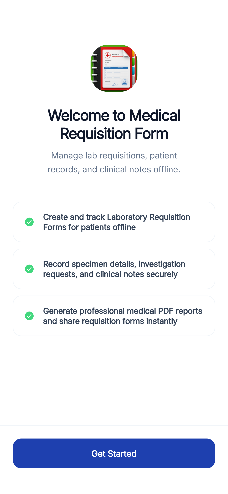
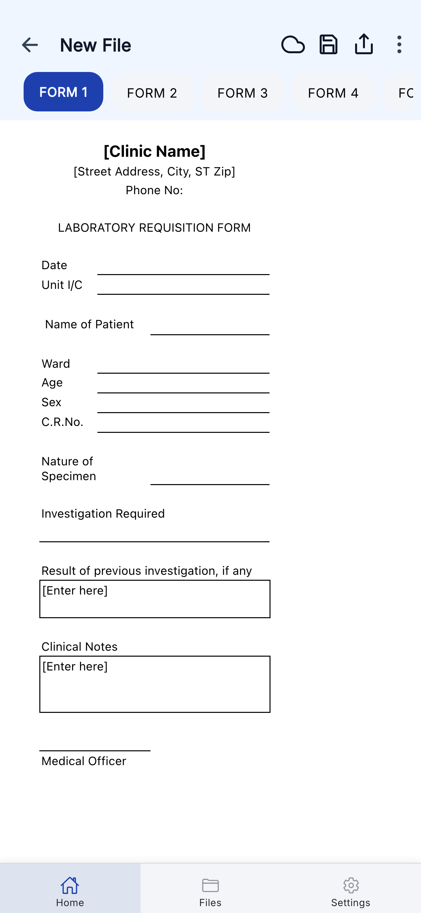
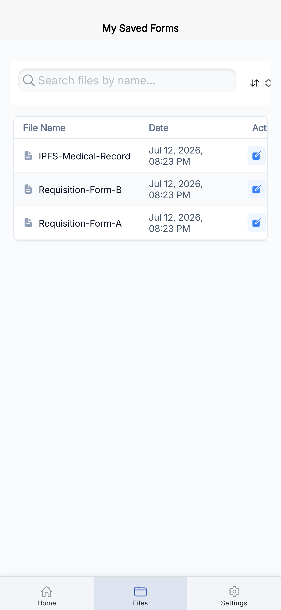
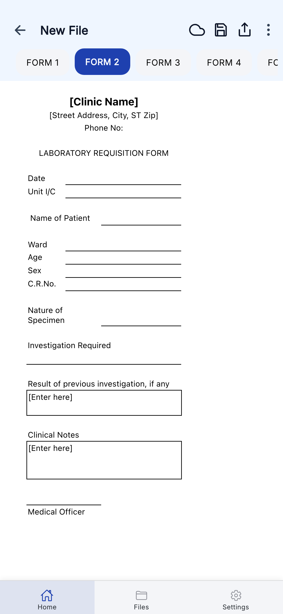
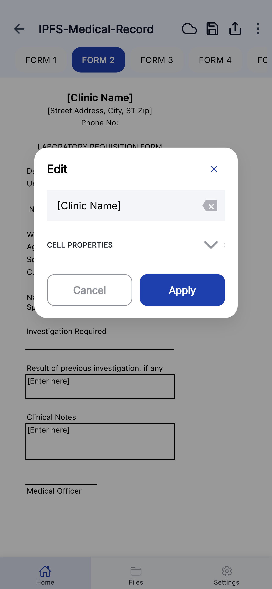
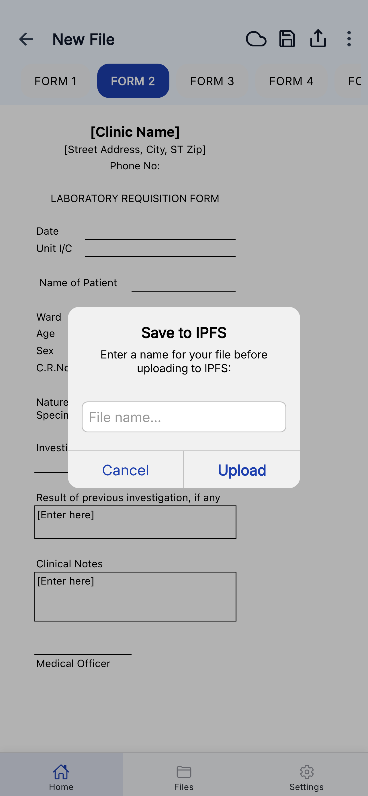
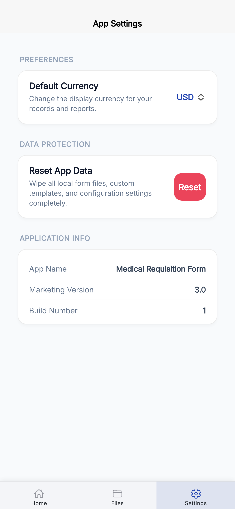

# 🏥 Medical Requisition Form

A premium, offline-first medical requisition and laboratory request tracking application built with the **Ionic Framework (React)** and **Capacitor**. It enables healthcare providers, clinics, and medical staff to manage lab requisitions, patient details, specimen records, and clinical notes completely offline. The core computation and grid layout engine is powered by a mobile-optimized adaptation of **SocialCalc** to deliver spreadsheet-grade reliability on touch screens.

---

## 🎨 Application Screenshots

### 🚀 Onboarding & Dashboard
| Welcome & Onboarding | Lab Requisition Form (Sheet 1) | Saved Forms List |
| :---: | :---: | :---: |
|  |  |  |

### 📈 Requisitions & Inputs
| Form 2 (Requisition Sheet 2) | Touch-optimized Input Overlay | Decentralized IPFS Cloud Save |
| :---: | :---: | :---: |
|  |  |  |

### ⚙️ Preferences & Setup
| Settings & Customization |
| :---: |
|  |

---

## ✨ Key Features

- **100% Offline-First Patient Storage**: Powered by `@capacitor-community/sqlite` for local, fast, and structured storage. All medical requisitions, patient records, and local templates reside completely offline on the local device, ensuring strict patient data privacy.
- **Mobile-Optimized SocialCalc Grid**: A legacy spreadsheet computation engine redesigned with custom mobile overlays, allowing healthcare professionals to easily input clinical details, specimen parameters, and laboratory requests via touch-screen keyboards.
- **Preconfigured Medical Requisitions**: Out-of-the-box template support for laboratory requisition sheets:
  - Patient Demographics (Name, Ward, Age, Sex, C.R. No.)
  - Specimen details (Nature of specimen, date, source)
  - Target investigations required
  - Results of previous investigations
  - Clinical notes & Medical Officer signatures
- **Decentralized IPFS Backups**: Integrated IPFS services allowing users to backup, sync, and securely share medical requisition sheets using cryptographic Content Identifiers (CIDs) on the IPFS network.
- **Professional Reports & Sharing**: Export individual sheets or consolidate all sheets to standard medical PDF reports. Print or share via native device sharing options.
- **Local Preferences & Customization**: Manage general configurations, display options, and execute secure data sanitization/wipes directly from the local Settings panel.

---

## 🛠️ Tech Stack & Architecture

- **Core Framework**: [Ionic React](https://ionicframework.com/docs/react) v8.7
- **UI & Logic**: React 19, TypeScript, Framer Motion
- **Native Bridge**: Capacitor v8
- **Database Layer**: SQLite (`@capacitor-community/sqlite`) as primary store, `localStorage` for application state synchronization.
- **Bundler**: Vite
- **Decentralized Storage**: IPFS Gateway APIs

```
┌─────────────────────────────────────────────────────────┐
│                        UI LAYER                         │
│   (DashboardHome, SocialCalcPage, Settings, Files)      │
└───────────────────────────┬─────────────────────────────┘
                            │
                            ▼
┌─────────────────────────────────────────────────────────┐
│                  CONTEXT & STATE LAYER                  │
│       InvoiceContext (React) ──▶ LocalStorage           │
└───────────────────────────┬─────────────────────────────┘
                            │
                            ▼
┌─────────────────────────────────────────────────────────┐
│                      SERVICE LAYER                      │
│   localTemplateService ──▶ repositories/ (SQLite DAOs)  │
└───────────────────────────┬─────────────────────────────┘
                            │
                            ▼
┌─────────────────────────────────────────────────────────┐
│                    DATA ACCESS LAYER                    │
│   DatabaseService ──▶ SQLite / Migration / Templates     │
└─────────────────────────────────────────────────────────┘
```

> [!NOTE]
> **Base Code Note**: Under the hood, this codebase leverages the flexible, modular structure of the "Invoice App" base template. While files and contexts within the source tree (such as `InvoiceContext.tsx` or `invoiceRepository.ts`) retain their base names for developer continuity, the application is dynamically re-themed, configured, and localized using the automation pipeline to run as the **Medical Requisition Form** with its corresponding templates (`medical_mob.json` and `medical_tab.json`).

---

## 🚀 Development & Setup

### Prerequisites
- Node.js (v18+)
- Ionic CLI (`npm install -g @ionic/cli`)

### Quick Start
1. Install dependencies:
   ```bash
   npm install
   ```
2. Start the development server locally:
   ```bash
   npm run dev
   ```
3. Run Unit Tests:
   ```bash
   npm run test.unit
   ```
4. Build Web Distribution:
   ```bash
   npm run build
   ```

### Capacitor Integration (Native Platforms)
To run on Android or iOS devices:
```bash
# Sync files to native folders
npx cap sync

# Run on iOS simulator/device
npx cap run ios

# Run on Android emulator/device
npx cap run android
```

---

## 🤖 App Automation & Rebranding Suite

This repository acts as a **base template** for generating customized, offline-first SocialCalc spreadsheet applications. Inside the [scripts](file:///Users/anirudhsharma/Desktop/C4GT/0. Base App Codebase/12 July/Ipfs Apps/medical-requisition-form/scripts) directory, you will find three distinct automation pipelines to rebrand, asset-generate, and screenshot-automate your target app variants.

### 1. App Configuration & Rebranding (`scripts/app-update-automation`)
Easily update the core identity, descriptions, icons, template configurations, theme colors, and PDF layouts across **19 files** in a single run.

*   **Configuration File**: [data.json](file:///Users/anirudhsharma/Desktop/C4GT/0. Base App Codebase/12 July/Ipfs Apps/medical-requisition-form/scripts/app-update-automation/data.json)
    Define app properties, onboarding screen features, brand primary/secondary colors, PWA parameters, and default template settings in this file.
*   **Automation Script**: [update-app.sh](file:///Users/anirudhsharma/Desktop/C4GT/0. Base App Codebase/12 July/Ipfs Apps/medical-requisition-form/scripts/app-update-automation/update-app.sh)
*   **How to execute**:
    Run the following command from the repository root:
    ```bash
    bash scripts/app-update-automation/update-app.sh
    ```

### 2. Branding Asset Generation (`scripts/app-assets-generation`)
This pipeline automatically scans the workspace to find high-resolution PNG templates for your app's icon and splash screen, sampling background colors to properly pad and export multi-platform assets.

*   **Generated Assets**:
    *   **iOS Assets**: iOS App Store high-res icon (`AppIcon-512@2x.png`) and universal Launch Screen splash images.
    *   **PWA/Web Assets**: Touch icons, favicons, and standard sizes (64x64, 192x192, 512x512) written directly to `public/`.
*   **Automation Script**: [generate_assets.sh](file:///Users/anirudhsharma/Desktop/C4GT/0. Base App Codebase/12 July/Ipfs Apps/medical-requisition-form/scripts/app-assets-generation/generate_assets.sh) (wrapping [generate_assets.py](file:///Users/anirudhsharma/Desktop/C4GT/0. Base App Codebase/12 July/Ipfs Apps/medical-requisition-form/scripts/app-assets-generation/generate_assets.py))
*   **How to execute**:
    Run the following command from the repository root:
    ```bash
    bash scripts/app-assets-generation/generate_assets.sh
    ```

### 3. App Store Screenshot Automation (`scripts/app-screenshot-automation`)
Automates high-resolution screenshot generation simulating all major iPhone and iPad viewports using Playwright. The script navigates the full application flow—onboarding, document editing, and options screens—and captures them for App Store Connect.

*   **Viewports Covered**:
    *   **6.9" Display**: iPhone 16 Pro Max (1320x2868 px)
    *   **6.5" Display**: iPhone 14 Plus / 13 Pro Max (1284x2778 px)
    *   **6.1" Display**: iPhone 16 / 15 / 14 / 13 / 12 (1170x2532 px)
    *   **13" iPad**: iPad Pro 13" (2064x2752 px)
    *   **11" iPad**: iPad Pro 11" (1668x2388 px)
*   **Configuration**: Customize viewports, targets, and edit cells/values inside [screenshot-config.json](file:///Users/anirudhsharma/Desktop/C4GT/0. Base App Codebase/12 July/Ipfs Apps/medical-requisition-form/scripts/app-screenshot-automation/screenshot-config.json).
*   **How to execute**:
    1. Make sure your local application server is running (e.g., `npm run dev` at `http://localhost:3000`).
    2. Navigate to the automation directory and install dependencies:
       ```bash
       cd scripts/app-screenshot-automation
       npm install
       npx playwright install
       ```
    3. Run the screen capturer:
       ```bash
       npm run capture
       ```
    *Screenshots will be output directly to the local `/screenshots` subdirectory grouped by device size.*
