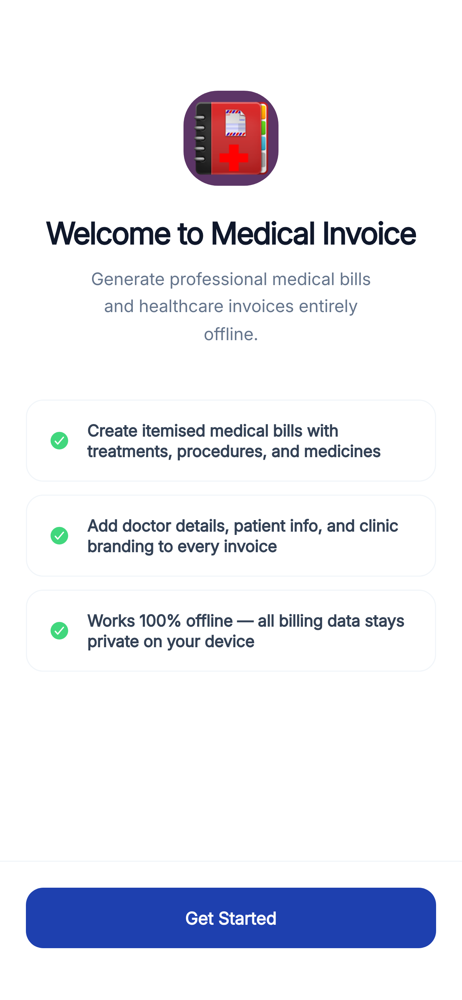
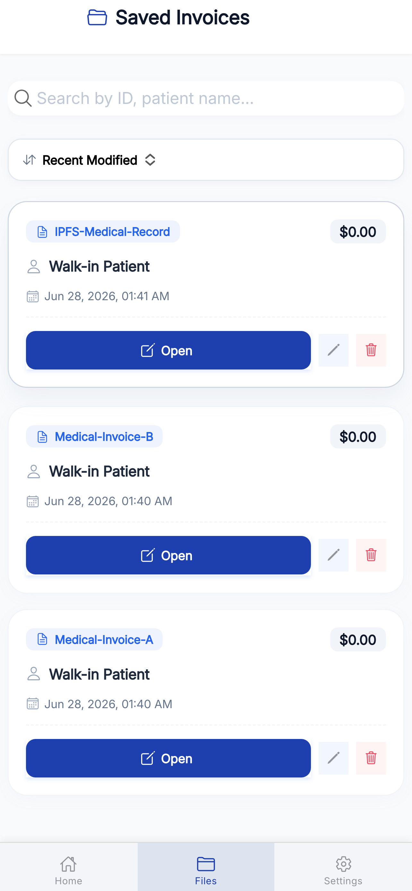
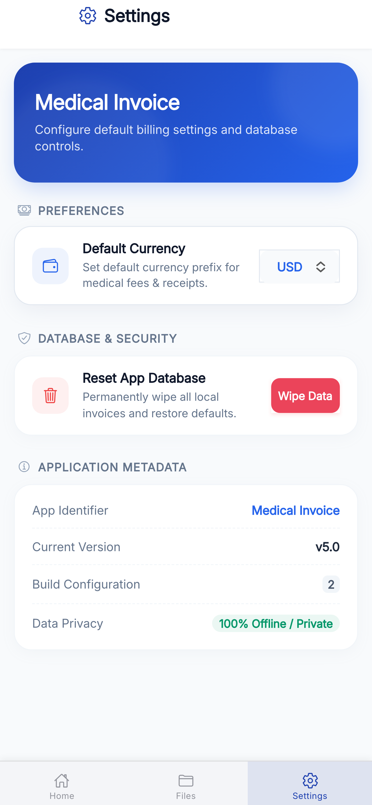
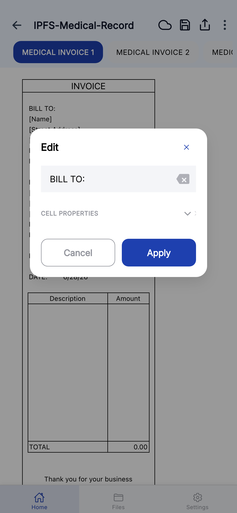
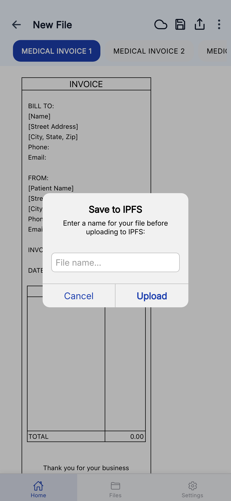
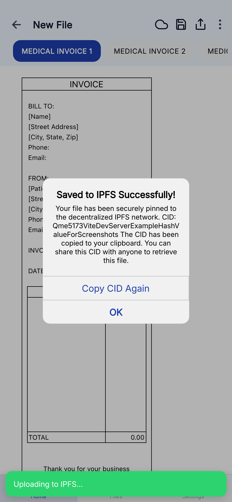

<div align="center">
 
# 🧾 Medical Invoice
 
### 📱 Premium Offline Medical Billing & Healthcare Invoice Generator
 
[](https://developer.apple.com)
[](https://developer.android.com)
[](https://capacitorjs.com)
[](https://reactjs.org)
[](https://www.typescriptlang.org)
[](https://ionicframework.com)

**Fully Offline Mobile & Tablet Medical Invoice App** 🚀
 
*A modern, offline-first medical invoice generator built with Ionic React and Capacitor. Create professional medical bills, prescription invoices, consultation fee receipts, and healthcare billing documents — all without any internet connection. Supports IPFS-based decentralized backups for tamper-proof record keeping.*
 
[💻 Dev Setup](#-installation--development) • [🧱 Project Structure](#%EF%B8%8F-project-structure) • [📖 Architecture](#-architecture)
 
</div>

---

## 📸 Screenshots

The user interface is optimized for rapid medical invoice creation, touch interactions, and offline-first storage:

<div align="center">

### 📱 Core Application Flow

<table>
  <tr>
    <td align="center" valign="top" width="33%"><br/><b>Welcome Onboarding</b></td>
    <td align="center" valign="top" width="33%"><br/><b>Saved Invoices Registry</b></td>
    <td align="center" valign="top" width="33%"><br/><b>Application Settings</b></td>
  </tr>
</table>

### 📊 Medical Invoice Sheets (Spreadsheet Engine)

<table>
  <tr>
    <td align="center" valign="top" width="33%"><br/><b>1. Patient & Clinic Information</b></td>
    <td align="center" valign="top" width="33%"><br/><b>2. Consultation & Check-Up Fees</b></td>
    <td align="center" valign="top" width="33%"><br/><b>3. Lab Tests & Diagnostic Charges</b></td>
  </tr>
  <tr>
    <td align="center" valign="top" width="33%"><br/><b>4. Medication & Prescription Billing</b></td>
    <td align="center" valign="top" width="33%"><br/><b>5. Treatment Log & Cost Tracking</b></td>
    <td align="center" valign="top" width="33%"><br/><b>Quick Invoice Data Entry</b></td>
  </tr>
</table>

### ☁️ Decentralized Backup & Verification Flow

<table>
  <tr>
    <td align="center" valign="top" width="50%"><br/><b>Save & Pin Invoice to IPFS</b></td>
    <td align="center" valign="top" width="50%"><br/><b>IPFS Pinning Confirmation</b></td>
  </tr>
</table>

</div>

---

## ✨ Core Features

<table>
<tr>
<td width="50%">

### 📴 100% Offline Capability
All invoices, patient data, clinic logos, signatures, and preferences are stored securely in the device's local storage. The app requires zero internet connectivity to create and manage medical invoices.

### 🔒 Patient Data Privacy
No cloud connections, telemetry, or remote databases. Sensitive patient billing information and medical records remain strictly on the user's device.

### 📋 Invoice Management
Create and manage multiple medical invoices (up to 15 saved invoices). Search, duplicate, edit, and delete invoices from a centralized file registry.

</td>
<td width="50%">

### 💼 SocialCalc Spreadsheet Engine
Built on a touch-optimized wrapper over the robust **SocialCalc spreadsheet engine**. Supports grid editing, column resizing, custom cell styling, alignment, and real-time formula calculations for automatic totals and tax computations.

### 🧾 Multi-Sheet Invoice Templates
Pre-designed medical invoice layouts with multiple sheets:
1. **Information**: Patient & clinic details, invoice number, date
2. **Check-Up**: Consultation fees, visit charges, procedures
3. **Tests**: Lab tests, diagnostics, imaging charges
4. **Drug**: Medication costs, prescription billing
5. **Log 1-3**: Treatment logs, cost tracking, payment history

</td>
</tr>
<tr>
<td width="50%">

### ✏️ Rapid Invoice Data Entry
Fill invoice fields through a clean, intuitive form interface that maps directly onto the spreadsheet grid — no manual cell editing required.

</td>
<td width="50%">

### 📄 Export as PDF & CSV
Generate professional, print-ready medical invoices as high-resolution PDFs. Export itemized billing data as CSV for accounting and insurance claim submissions.

</td>
</tr>
<tr>
<td width="50%">

### ☁️ Decentralized IPFS Backups
Pin and backup medical invoices to the IPFS network (via Pinata Gateway) to create immutable, tamper-proof billing records that are verifiable and retrievable from anywhere.

</td>
<td width="50%">

### 🤖 Automation Suite
Built-in scripts for automated native asset generation (icons, splash screens), simulator screenshots, and branding configuration patchers for rapid app variant deployment.

</td>
</tr>
</table>

---

## 🛠️ Tech Stack

<div align="center">

| Layer | Technology | Purpose |
|:---|:---|:---|
| **Core UI Framework** | **React 19** & **Ionic 8** | Mobile-first invoice components, smooth transitions, and native tab navigation |
| **Language** | **TypeScript** | Strict type safety across invoice data models, templates, and service layers |
| **Native Integration** | **Capacitor 8** | Runtime bridge for native iOS and Android compilation |
| **Spreadsheet Engine** | **SocialCalc (Legacy)** | Formula evaluation, grid rendering, multi-sheet invoice state management |
| **Storage** | **localStorage** | Offline JSON serialization for invoices, templates, and user preferences |
| **Build & Bundle** | **Vite 7** | Fast HMR development server and optimized production bundling |
| **PDF Generation** | **jsPDF + html2canvas** | Client-side high-fidelity PDF export of medical invoices |
| **Decentralized Storage** | **IPFS (Pinata)** | Tamper-proof invoice backup and verification via content-addressed hashing |

</div>

---

## 📲 Installation & Development

### Prerequisites

- ✅ Node.js v18 or higher
- ✅ npm or yarn
- ✅ Xcode 15+ (for iOS simulator/device builds)
- ✅ macOS (required for native iOS compilation)

### Development Steps

```bash
# 1. Install project dependencies
npm install

# 2. Run local web development server
npm run dev

# 3. Compile static production bundles
npm run build

# 4. Sync web assets with Capacitor native bridge
npx cap sync ios

# 5. Open iOS Xcode Project workspace
npx cap open ios
```

Inside Xcode, select target simulator/device and run. For Android development, configure the Android SDK and use `npx cap sync android`.

---

## 🧱 Project Structure

```
📦 medical-invoice/
├── 📂 ios/                  # Xcode Native iOS project files
├── 📂 src/
│   ├── 📂 components/       # Reusable UI components
│   │   ├── 📂 Files/        # Invoice file listing and actions
│   │   ├── 📂 Storage/      # Client localStorage adapter
│   │   └── 📂 socialcalc/   # SocialCalc grid renderer and config
│   ├── 📂 contexts/         # React state managers (Invoice Context)
│   ├── 📂 data/             # Data layer definitions
│   │   ├── 📂 repositories/ # localStorage CRUD (SavedInvoices)
│   │   └── schema.ts        # Invoice model schemas & identifiers
│   ├── 📂 pages/            # Screen components (Dashboard, Files, Settings, Onboarding)
│   ├── 📂 services/         # PDF export, CSV export, template service, IPFS service
│   ├── 📂 utils/            # Analytics, settings helpers, math utilities
│   └── 📂 types/            # TypeScript interfaces
├── 📂 public/
│   ├── 📂 templates/        # Invoice template JSON layouts (mobile & tablet)
│   │   ├── 📂 data/         # Template spreadsheet data (mobile.json, tablet.json)
│   │   └── 📂 meta/         # Template metadata (name, type, hashtags)
│   └── 📂 assets/           # App logos, icons & splash screen assets
├── 📂 scripts/
│   └── 📂 app-update-automation/  # Branding config & automated patchers
├── 📄 capacitor.config.ts   # Capacitor runtime bridge configuration
├── 📄 ionic.config.json     # Ionic build parameters
└── 📄 package.json          # Package manifest & build scripts
```

---

## 📖 Architecture

The application runs on a fully offline, client-side architecture:

```
┌────────────────────────────────────────────────────────┐
│                  🧾 IONIC UI LAYER                     │
│   Dashboard Home │ Invoice Editor │ Files Registry      │
└───────────────────────────┬────────────────────────────┘
                            │
┌───────────────────────────▼────────────────────────────┐
│                  🔄 REACT STATE BRIDGE                 │
│         Invoice Context + Device Preferences           │
└───────────────────────────┬────────────────────────────┘
                            │
┌───────────────────────────▼────────────────────────────┐
│                    💾 STORAGE LAYER                    │
│      localStorage (Invoices, Templates, Settings)      │
└───────────────────────────┬────────────────────────────┘
                            │
┌───────────────────────────▼────────────────────────────┐
│                  ☁️ IPFS BACKUP LAYER                  │
│       Pinata Gateway (Immutable Invoice Pinning)       │
└────────────────────────────────────────────────────────┘
```

- **State Sync**: Invoice Context loads persisted invoices from `localStorage` on initial mount.
- **Save Flow**: Form changes validate, map back to SocialCalc's MSC format, and write to `localStorage` key `invoicecalc_saved_invoices`.
- **IPFS Backup**: Invoices can be pinned to the IPFS network via Pinata for decentralized, tamper-proof archival.
- **Performance**: Formula calculations (totals, taxes, discounts) execute directly on the legacy SocialCalc engine within the client webview.

---

## 🤝 Contributing

Contributions are welcome! Please feel free to submit a Pull Request.

1. Fork the repository
2. Create your feature branch (`git checkout -b feature/AmazingFeature`)
3. Commit your changes (`git commit -m 'Add some AmazingFeature'`)
4. Push to the branch (`git push origin feature/AmazingFeature`)
5. Open a Pull Request

---

## 📄 License

This project is licensed under the MIT License - see the [LICENSE](LICENSE) file for details.
