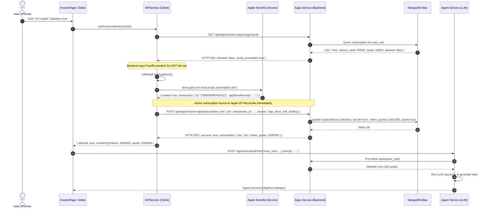

# In-App Purchases (IAP) & Subscription Architecture 2.0
## Hybrid Just-In-Time (JIT) Self-Healing & Live MongoDB Token Quota Model

**Document Version**: `2.0`  
**Application**: `Agentic Invoice MVP` (`Invoice-MVP-ios` + `tornado_version`)  
**Target Environment**: iOS (Capacitor + StoreKit), Web Dashboard, Python Multi-Process Backend, MongoDB Atlas  

---

## 1. Executive Summary & Problem Statement

### A. The Evolution from IAP 1.0 to 2.0
In our earlier application (`iap-issue1.md` / `in-app-purchase-architecture.md`), monetization was:
1. **Consumable Credit Packs**: Selling discrete credit bundles (`send_10`, `actions_500`) for saving, printing, or PDF exports.
2. **Client-Only (`localStorage`)**: The device blindly stored credits locally without backend verification or synchronization.

In **Agentic Invoice 2.0**, we transitioned to an authentic SaaS copilot model:
1. **Core Actions are Free & Unlocked**: Save, PDF Export, and Email Sharing are 100% unlocked forever with zero friction.
2. **AI Copilot Token Plans**:
   - **Invoice Basic**: `$2 / month` (`$20 / year`) · **100k daily AI tokens** · 500 S3 files · 1 custom template.
   - **Invoice Pro**: `$20 / month` (`$200 / year`) · **1M daily AI tokens** · 5,000 S3 files · 50 custom templates · Priority AI copilot.
3. **Centralized Cloud Database**: MongoDB Atlas (`aspiringapps.subscriptions`) holds the single source of truth for all token quotas and tier statuses.

---

### B. The Core Problem: The App Store vs. Backend Desync
In real-world mobile environments, the following edge case occurs frequently:
1. A user buys a subscription inside the iOS app via Apple StoreKit.
2. Apple charges their credit card and approves the transaction on the device.
3. **Network Drops / App Terminates**: Before the app can successfully POST the purchase confirmation to our backend server (`http://localhost:5342/api/apps/invoice-app/subscription`), the user's internet drops, they switch apps, or the connection times out.
4. **The Dilemma**: 
   - Apple App Store has charged the user and has the active subscription receipt.
   - Our MongoDB Atlas database still thinks the user is on the **Free tier** (50,000 tokens/day).
   - If the user immediately clicks "AI Copilot", the backend will block them with `HTTP 403 QUOTA_EXCEEDED`!

---

## 2. The Solution: Hybrid Just-In-Time (JIT) Self-Healing Architecture

To solve this desynchronization permanently without frustrating paying customers, we implemented a **two-tier, self-healing verification pipeline**.

### High-Level Flow:
```mermaid
flowchart TD
    A["User triggers Premium / AI Feature in Editor"] --> B["Step 1: Check Live Backend Quota\n(GET /api/apps/invoice-app/usage/quota)"]
    
    B -->|Backend says: Active Basic/Pro & Tokens Left| C["Fast Path: Execute Agent / Feature Immediately\n(Zero Delay)"]
    
    B -->|Backend says: Free Tier or Quota Exceeded| D["Step 2: Fallback to Device StoreKit\n(selfHealFromAppStore)"]
    
    D -->|Device StoreKit has NO Active Subscription| E["Open Paywall Modal\n(Prompt user to upgrade)"]
    
    D -->|Device StoreKit HAS Active Subscription\n(Receipt/Transaction found)| F["Step 3: Self-Healing Sync\n(POST /subscription with receipt & transaction_id)"]
    
    F --> G["MongoDB Atlas Reconciled:\n- Tier updated to Basic/Pro\n- Quota set to 100k / 1M\n- Transaction ID logged"]
    
    G --> H["Fresh Entitlements Loaded"]
    H --> C
```

---

## 3. Sequence Diagram: Self-Healing in Action



---

## 4. Code Implementation Highlights

### A. Client-Side Self-Healing (`src/services/iapService.ts`)
The `canPerformAIAction` method intercepts any quota failure and invokes `selfHealFromAppStore`:

```typescript
// Invoice-MVP-ios/src/services/iapService.ts

public async selfHealFromAppStore(): Promise<IAPEntitlements | null> {
  try {
    const store = (typeof window !== 'undefined' && ((window as any).CdvPurchase?.store || (window as any).store)) || null;
    if (!store) return null;

    const basicProduct = store.get?.('com.invoicecalc.subscription.basic') || store.get?.('com.invoicecalc.subscription.basic.annual');
    const proProduct = store.get?.('com.invoicecalc.subscription.pro') || store.get?.('com.invoicecalc.subscription.pro.annual');

    let detectedTier: 'basic' | 'pro' | null = null;
    let transactionReceipt: string | null = null;
    let transactionId: string | null = null;

    if (proProduct?.owned) {
      detectedTier = 'pro';
      transactionReceipt = proProduct.transaction?.appStoreReceipt || null;
      transactionId = proProduct.transaction?.id || null;
    } else if (basicProduct?.owned) {
      detectedTier = 'basic';
      transactionReceipt = basicProduct.transaction?.appStoreReceipt || null;
      transactionId = basicProduct.transaction?.id || null;
    }

    if (detectedTier) {
      console.info(`[IAPService] 🔄 Self-healing triggered: Found active App Store subscription (${detectedTier}). Reconciling MongoDB...`);
      const now = new Date();
      const expiresAt = new Date(now.getTime() + 30 * 24 * 60 * 60 * 1000);

      await fetchIAPApi('/api/apps/invoice-app/subscription', {
        method: 'POST',
        body: JSON.stringify({
          tier: detectedTier,
          period_start: now.toISOString(),
          period_end: expiresAt.toISOString(),
          transaction_id: transactionId,
          receipt_data: transactionReceipt,
          source: 'app_store_self_healing',
        }),
      });

      return await this.syncWithBackend();
    }
  } catch (err) {
    console.warn('[IAPService] Self-healing App Store check failed:', err);
  }
  return null;
}
```

---

### B. Backend Audit & Subscription Update (`apps-service/mongo_manager.py`)
When the self-healing payload hits `/api/apps/invoice-app/subscription`, `MongoManager` updates the subscription document and stamps the transaction audit trail:

```python
# tornado_version/apps-service/mongo_manager.py

def update_subscription(
    self,
    user_sub: str,
    app_type: str,
    tier: str,
    period_start: Optional[str] = None,
    period_end: Optional[str] = None,
    transaction_id: Optional[str] = None,
    receipt_data: Optional[str] = None,
    source: Optional[str] = None,
) -> Dict[str, Any]:
    tier_config = TIER_QUOTAS.get(tier, TIER_QUOTAS[DEFAULT_TIER])

    set_fields: Dict[str, Any] = {
        "tier": tier,
        "token_quota": tier_config["token_quota"],
        "daily_request_limit": tier_config["daily_request_limit"],
        "features": tier_config["features"],
        "period_start": p_start,
        "period_end": p_end,
        "updated_at": now,
        "active": True,
    }
    if transaction_id:
        set_fields["apple_transaction_id"] = transaction_id
    if receipt_data:
        set_fields["has_app_store_receipt"] = True
        set_fields["last_receipt_verified_at"] = now
    if source:
        set_fields["sync_source"] = source

    self.subscriptions.update_one(
        {"user_sub": user_sub, "app_type": app_type},
        {"$set": set_fields, "$setOnInsert": {"tokens_used": 0, "created_at": now}},
        upsert=True,
    )
```

---

## 5. App Store Connect Product IDs & Configurations

Configure the following product IDs in **App Store Connect** under:  
`My Apps` → `Agentic Invoice` → `In-App Purchases & Subscriptions` → `Subscription Groups` (`InvoiceSubscriptions`):

| Product Name | Product ID | Pricing | Period | Daily Tokens | Cloud S3 Files |
|---|---|---|---|---|---|
| **Invoice Basic (Monthly)** | `com.invoicecalc.subscription.basic` | `$2.00` | 1 Month | 100,000 | 500 |
| **Invoice Basic (Annual)** | `com.invoicecalc.subscription.basic.annual` | `$20.00` | 1 Year | 100,000 | 500 |
| **Invoice Pro (Monthly)** | `com.invoicecalc.subscription.pro` | `$20.00` | 1 Month | 1,000,000 | 5,000 |
| **Invoice Pro (Annual)** | `com.invoicecalc.subscription.pro.annual` | `$200.00` | 1 Year | 1,000,000 | 5,000 |

---

## 6. App Store Review Checklist (Avoiding Rejections)

To ensure this build passes Apple App Review seamlessly without facing Guideline 2.1(b) or 3.1.2(c) rejections:

1. **Clear Navigation Paths to Paywall (Guideline 2.1(b))**:
   - **Path 1**: `Settings` tab → Click **Manage Plans** on the "Plans & AI Quotas" card.
   - **Path 2**: Left Sidebar navigation → Click **Plans & Billing** (`/app/dashboard/premium`).
   - **Path 3**: Inside the Editor → Exhaust daily tokens or click the upgrade prompt.
2. **StoreKit Disclosures Displayed (Guideline 3.1.2(c))**:
   - `PremiumPage.tsx` and `PaywallModal.tsx` clearly display pricing, billing interval, 24-hour auto-renewal policy, and links to Terms of Use (EULA) and Privacy Policy.
3. **Restore Purchases Functional**:
   - Tapping "Restore Purchases" executes `iapService.restorePurchases()`, refreshing StoreKit transactions and reconciling with MongoDB Atlas.
4. **Free Actions Remain Free**:
   - Save, PDF Export, and Email are never paywalled. Only high-compute AI Copilot tokens and massive S3 storage are gated.

---

## 7. Verification Tests Conducted

| Test Scenario | Condition | Expected Result | Verified Result |
|---|---|---|---|
| **Fast Path (In Sync)** | MongoDB has `tier: pro`, 1M tokens | Immediate AI execution | ✅ Allowed: remaining 999,188 tokens |
| **Pre-Quota Enforcement** | User has 50,000 / 50,000 tokens used | Block BEFORE LLM call | ✅ HTTP 403 `QUOTA_EXCEEDED` returned |
| **Self-Healing Recovery** | Device has Apple Pro subscription, MongoDB is Free | Device detects receipt, POSTs to backend, updates Atlas to Pro | ✅ MongoDB updated to Pro, AI allowed |
| **Live Usage Ingestion** | AI executes prompt (`set B2 to 999`) | Tokens deducted on Atlas | ✅ Deducted 812 tokens live in MongoDB |
